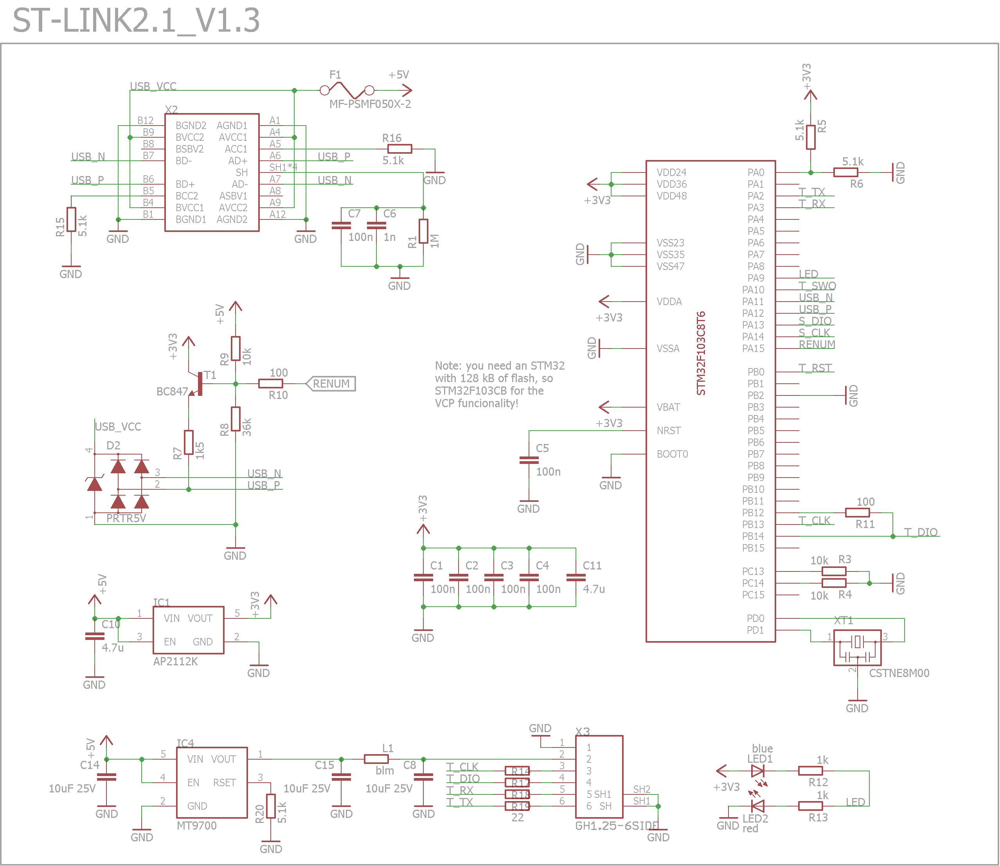
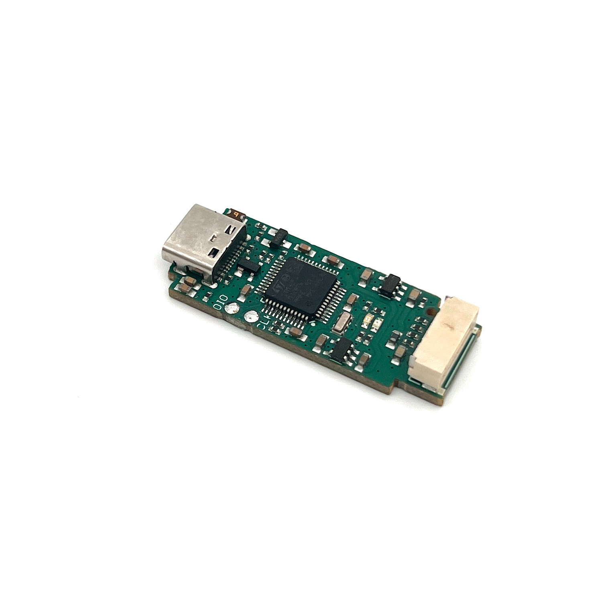
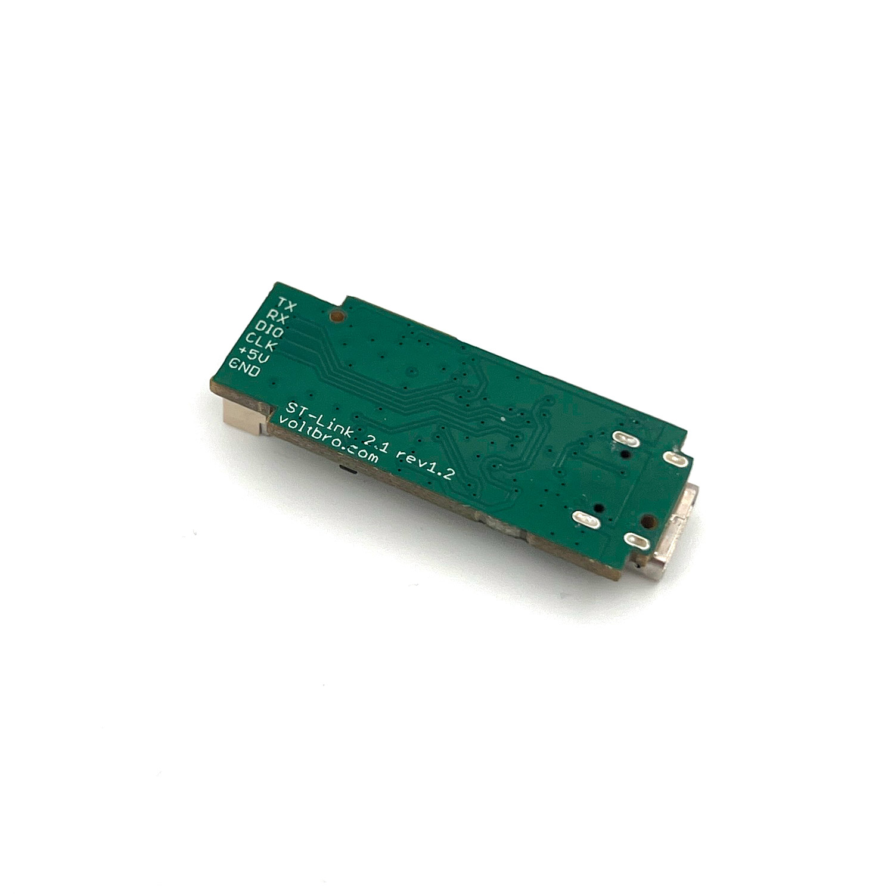
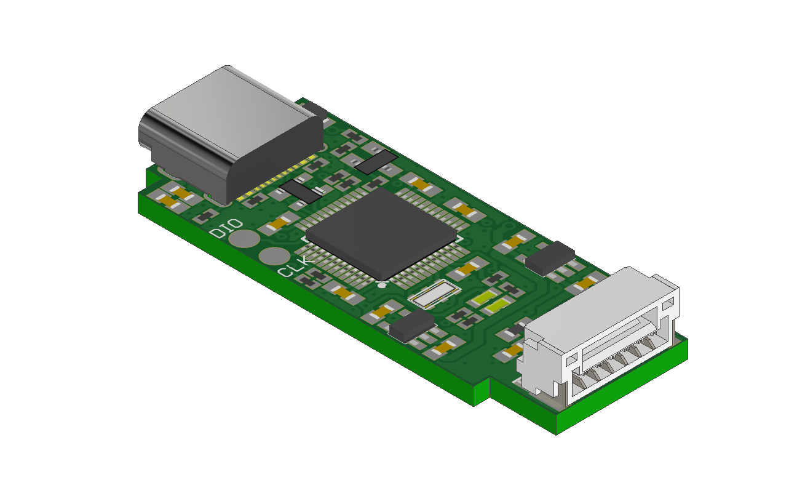

# VB STM32 Programmer 

### Overview
To reduce the size of the VBCore embedded module, a JST GH series programming and debugging connector with a 1.25 mm pitch is installed. Additionally, the programming pins are exposed on the module's contact pads.

For user convenience, we developed a custom miniature programmer board compatible with ST-Link V2.1 rev 1.1 and its interface connector. Our programmer also supports serial communication (Virtual Com Port) routed through the programming connector.

Additionally, a [small adapter board](https://github.com/VBCores/VBCores_files/tree/main/13-VB-STLink-Adapter) is available for standard ST-Link programmers, but without VCP (Virtual Com Port) support.

### Pinout

PDF version: [vb-stlink-v2_1-r1_3-pinout.pdf](vb-stlink-v2_1-r1_3-pinout.pdf)

### Schematic

PDF version: [vb-stlink-v2_1-r1_3-schematic.pdf](vb-stlink-v2_1-r1_3-schematic.pdf)

### SWD Interface

JST GH1.25, 6pin

| Pin      | Is           | 
| -------- | -------------|
| 1        | GND          |
| 2        | 5V           |
| 3        | SWCLK        |
| 4        | SWDIO        |
| 5        | TX USART2    |
| 6        | RX USART2    |

### Photos

### 3D model

STEP model: [vb-stlink-v2_1-r1_3.stp](vb-stlink-v2_1-r1_3.stp)
 
Texture top: [vb-stlink-v2_1-r1_3-texture-top.png](vb-stlink-v2_1-r1_3-texture-top.png)
 
Texture bottom: [vb-stlink-v2_1-r1_3-texture-bottom](vb-stlink-v2_1-r1_3-texture-bottom.png)

