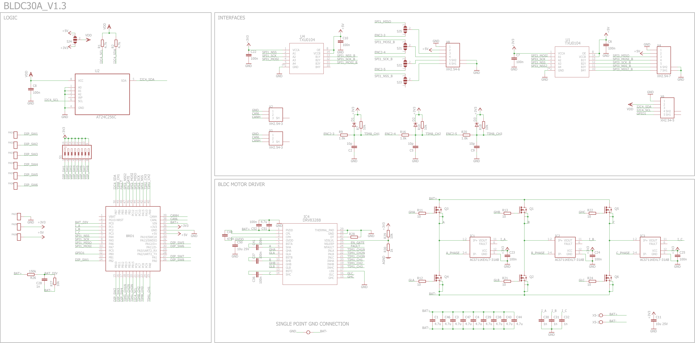

# VBCores BLDC motor driver

## Overview
The VBCores BLDC driver is an advanced solution for controlling sensored brushless DC motors. It supports a 3-phase Hall sensor as well as absolute encoders with SPI or I2C interfaces. The device is equipped with Hall-effect current sensors on all three phases. Operating at 40kHz with FOC, it ensures low response times for smooth and efficient motor control.

Based on [VB32G4 controller](https://github.com/VBCores/VBCores_files/tree/main/01-VB-Core32G4) 

### Features
- **Driver IC:** TI DRV8328B 
- **3-phase current sensing**
- **Interfaces:**
	- Full-duplex SPI master
	- Combined 3-phase Hall / ABZ incremental encoder / 2nd full-duplex SPI master
	- I2C with optional power supply: 5V / 3.3V
- **256-Kbit I2C EEPROM**
- **IO**: 8bit dip-switch, 6 bits are available at solder-on pads together with 5V and 3.3V.

### Specs
- **Power Input**: 9-60V
- **Phase Current**: 30A
  
### Dimensions
- PCB: 51x56 mm
- Mount holes: 45x50 mm

### Schematic

#### Datasheet

### SWD Interface

JST GH1.25, 6pin

| Pin      | Is           | 
| -------- | -------------|
| 1        | GND          |
| 2        | 5V           |
| 3        | SWCLK        |
| 4        | SWDIO        |
| 5        | TX USART2    |
| 6        | RX USART2    |

### Development Resources

### Photos

