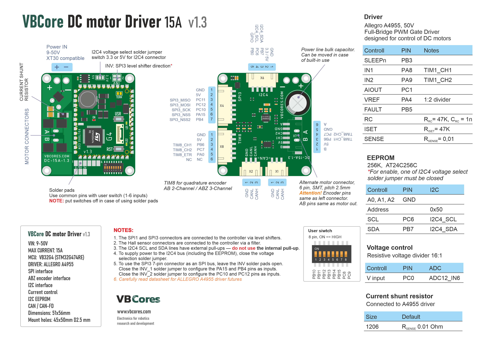
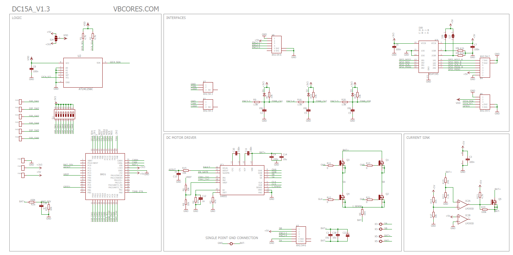
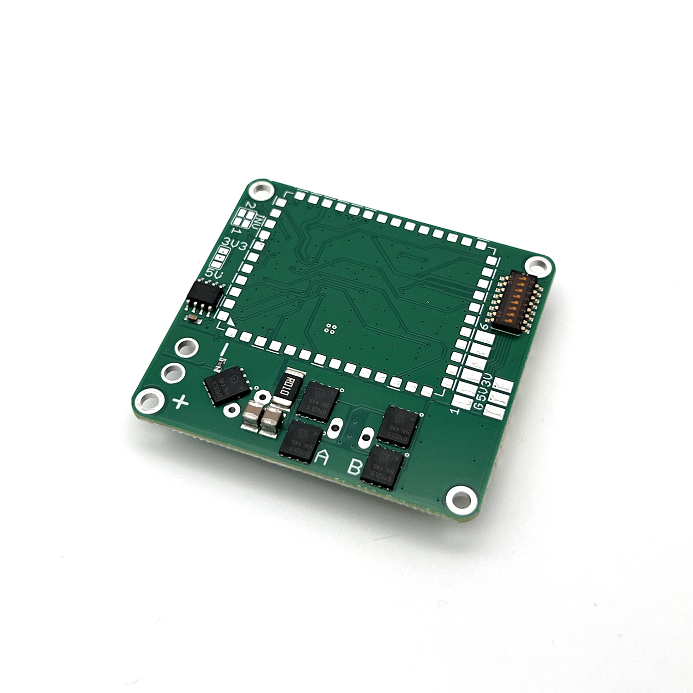
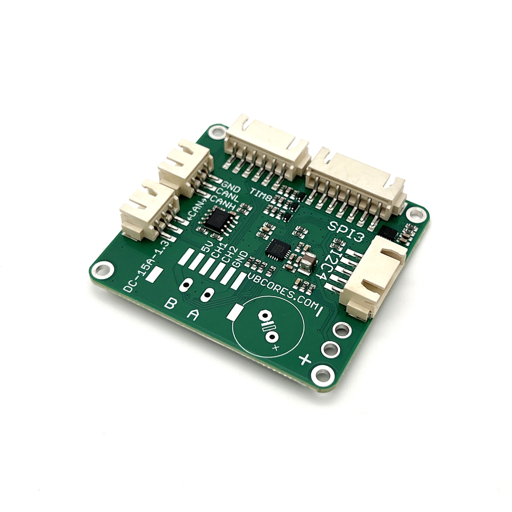
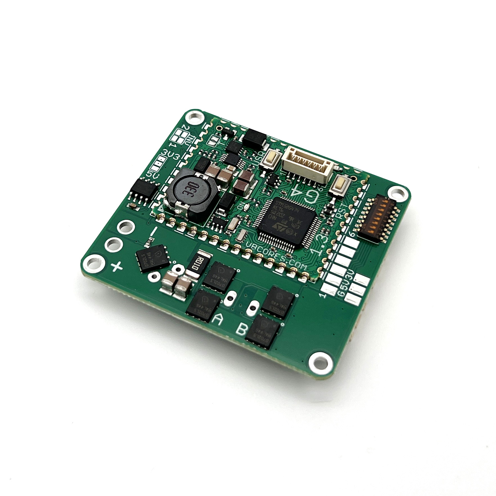
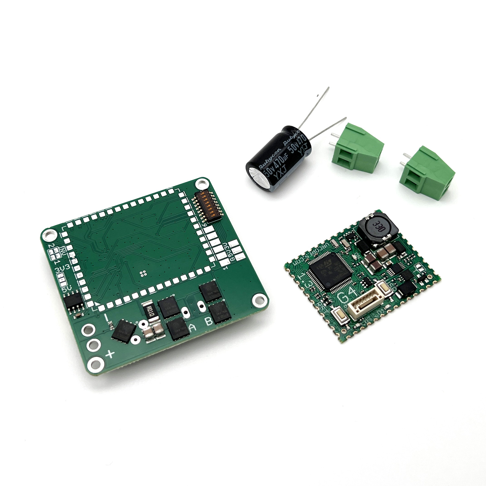
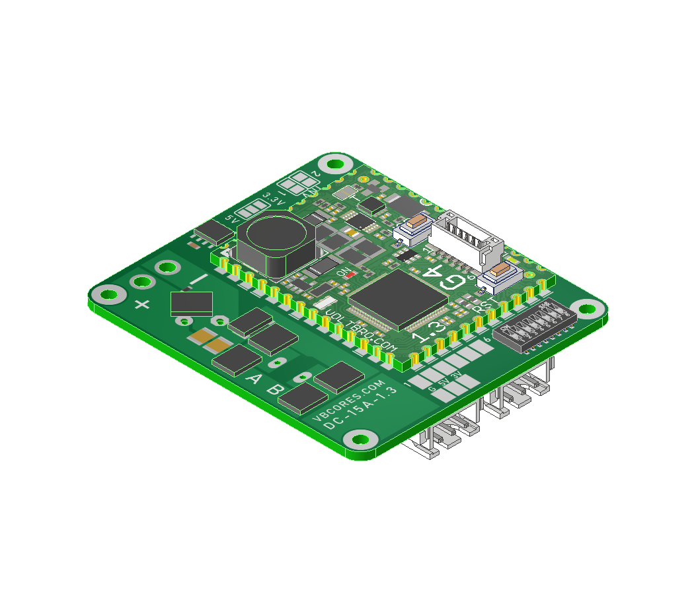
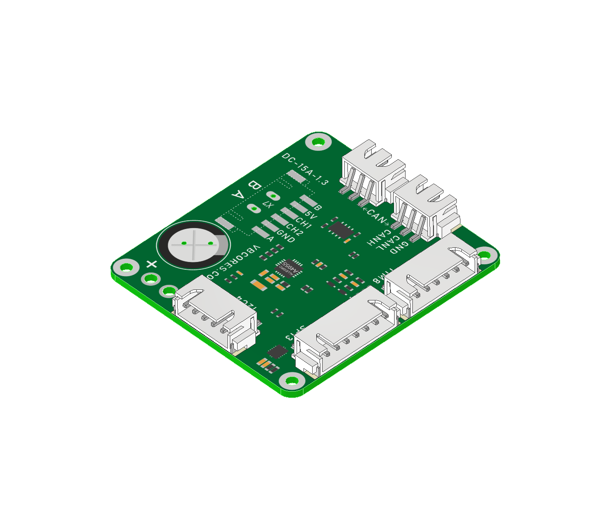

# VBCores DC motor driver v1.3

## Overview
The VBCores DC driver is an advanced solution for controlling brushed DC motors. It supports an ABZ encoder as well as absolute encoders with SPI or I2C interfaces. 

Based on [VB32G4 controller](https://github.com/VBCores/VBCores_files/tree/main/01-VB-Core32G4) 

### Features
- **Driver IC:** Allegro A4955
- **Back EMF protection**
- **Interfaces:**
	- Full-duplex SPI master
	- ABZ incremental encoder
	- I2C with optional power supply: 5V / 3.3V
- **256-Kbit I2C EEPROM**
- **IO**: 8bit dip-switch, 6 bits are available at solder-on pads together with 5V and 3.3V.

### Specs
- **Power Input**: 9-50V
- **Motor Current**: 15A

  
### Dimensions
- PCB: 51x56 mm
- Mount holes: 45x50 mm

#### Pinout

PDF version: [vb-dc-driver-v1_3-pinout.pdf](vb-dc-driver-v1_3-pinout.pdf)

### Schematic

PDF version: [vb-dc-driver-v1_3-schematic.pdf](vb-dc-driver-v1_3-schematic.pdf)

### SWD Interface for VBCore32G4

JST GH1.25, 6pin

| Pin      | Is           | 
| -------- | -------------|
| 1        | GND          |
| 2        | 5V           |
| 3        | SWCLK        |
| 4        | SWDIO        |
| 5        | TX USART2    |
| 6        | RX USART2    |

### Development Resources

### Photos

### 3D model

STEP model: [vb-dc-driver-v1_3.stp](vb-dc-driver-v1_3.stp)
 
Texture top: [vb-dc-driver-v1_3-texture-top.png](vb-dc-driver-v1_3-texture-top.png)
 
Texture bottom: [vb-dc-driver-v1_3-texture-bottom.png](vb-dc-driver-v1_3-texture-bottom.png)

