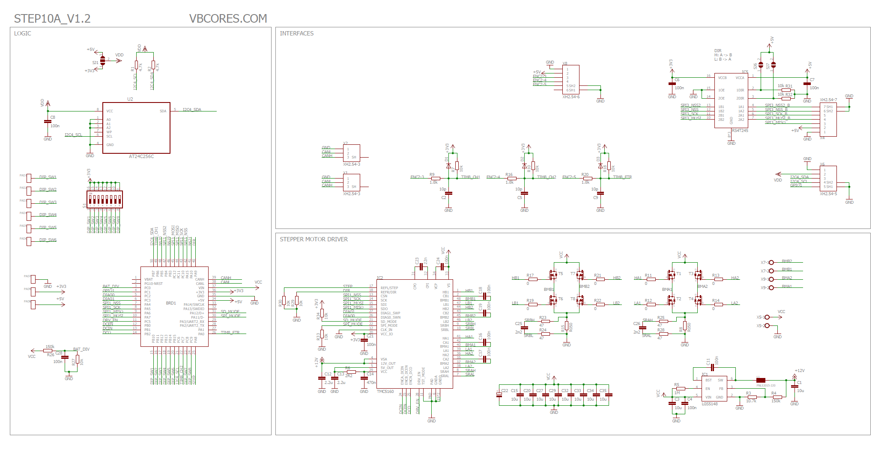
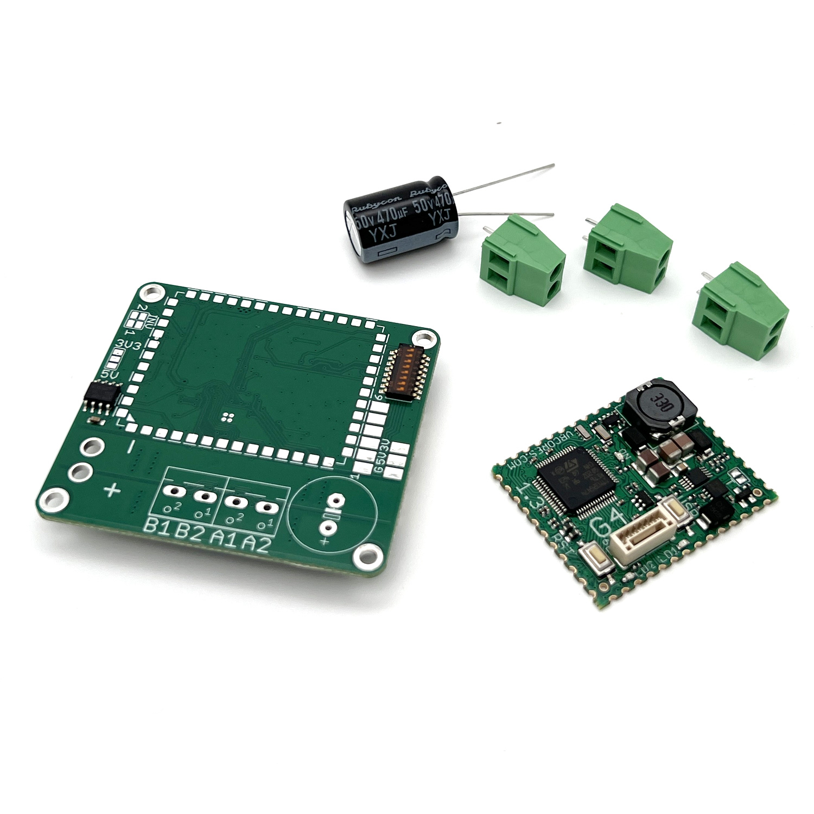

# VBCores stepper motor driver v1.2

## Overview
The VBCores stepper motor driver is an advanced solution for controlling sensored stepper motors. It supports an ABZ encoder as well as absolute encoders with SPI or I2C interfaces. High-end TMC5160 driver IC ensures efficient and silent operation.

Based on [VB32G4 controller](https://github.com/VBCores/VBCores_files/tree/main/01-VB-Core32G4) 

## Features
- **Driver IC:** TRINAMIC TMC5160 with SPI interface
- **Noiseless operation**
- **Interfaces:**
	- Full-duplex SPI master / or GPIO
	- ABZ incremental encoder
	- I2C with optional power supply: 5V / 3.3V
- **256-Kbit I2C EEPROM**
- **IO**: 8bit dip-switch, 6 bits are available at solder-on pads together with 5V and 3.3V.

## Specs
- **Power Input**: 9-50V
- **Phase Current**: 10A
  
### Dimensions
- PCB: 51x56 mm
- Mount holes: 45x50 mm

#### Pinout

PDF version: [vb-stepper-driver-v1_2-pinout.pdf](vb-stepper-driver-v1_2-pinout.pdf)

### Schematic

PDF version: [vb-stepper-driver-v1_2-schematic.pdf](vb-stepper-driver-v1_2-schematic.pdf)

### SWD Interface

JST GH1.25, 6pin

| Pin      | Is           | 
| -------- | -------------|
| 1        | GND          |
| 2        | 5V           |
| 3        | SWCLK        |
| 4        | SWDIO        |
| 5        | TX USART2    |
| 6        | RX USART2    |

### Development Resources

### Photos

### 3D model

STEP model: [vb-stepper-driver-v1_2.stp](vb-stepper-driver-v1_2.stp)
 
Texture top: [vb-stepper-driver-v1_2-texture-top.png](vb-stepper-driver-v1_2-texture-top.png)
 
Texture bottom: [vb-stepper-driver-v1_2-texture-bottom.png](vb-stepper-driver-v1_2-texture-bottom.png)

