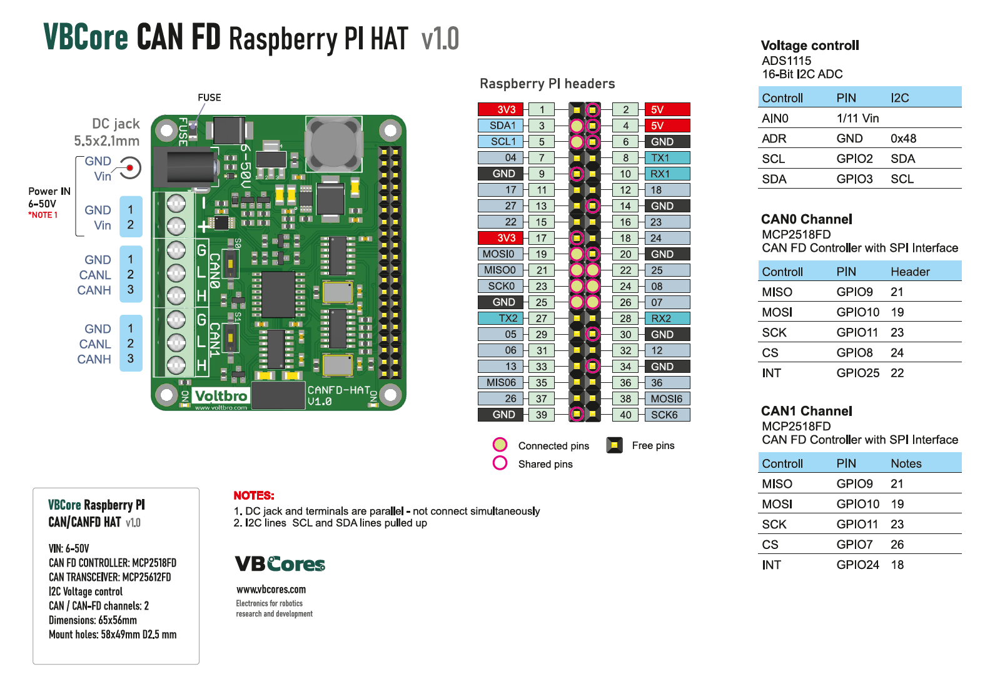
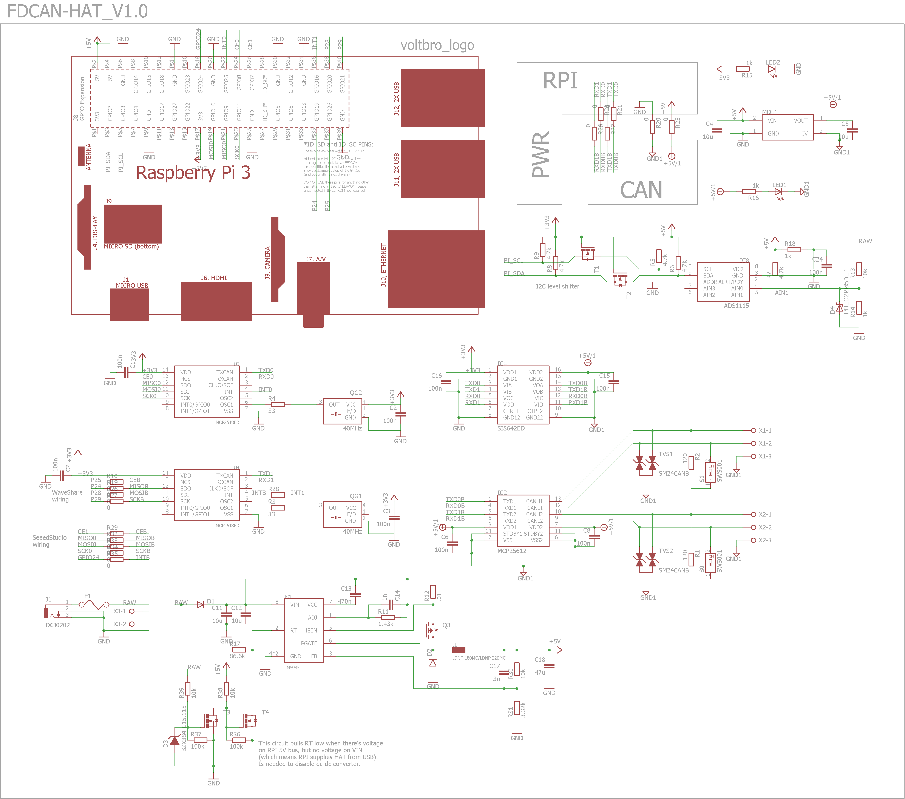
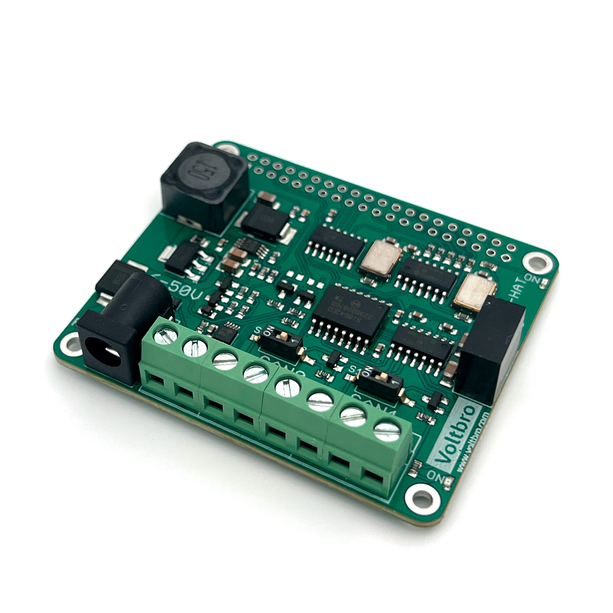
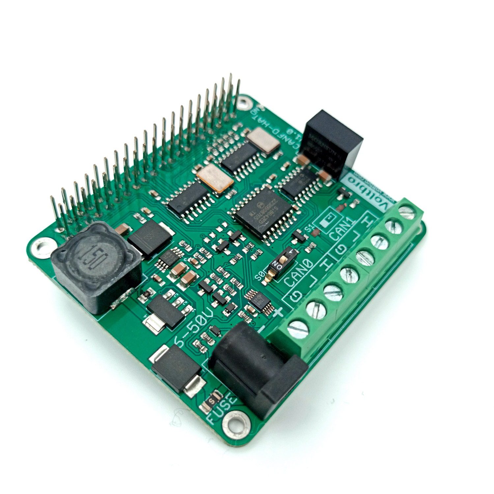
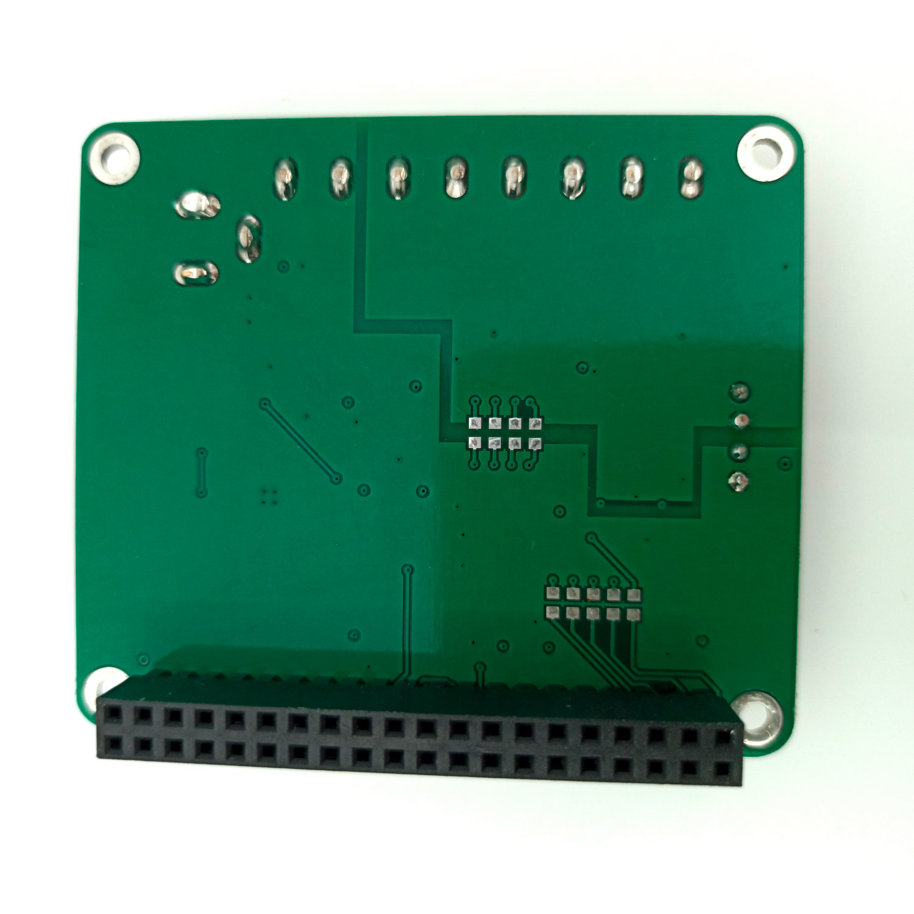
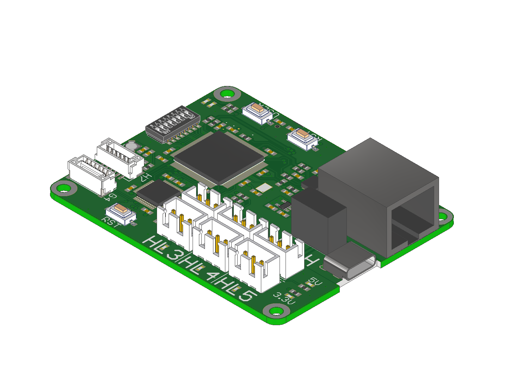
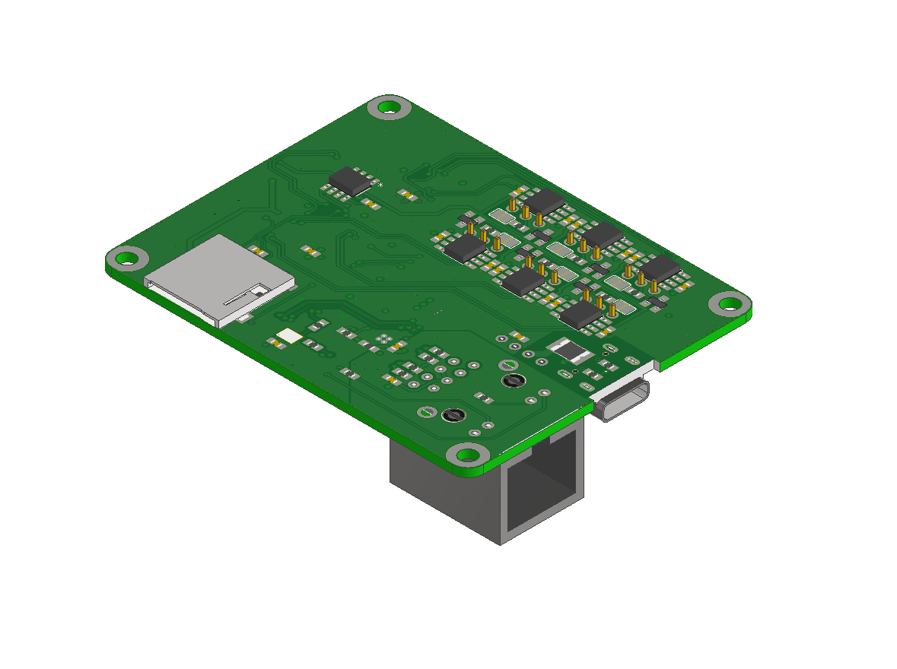

# VBCores CAN-FD HAT

## Overview
The CAN FD HAT provides the ability to connect Raspberry Pi to the CAN FD bus. Two independent channels are available, galvanically isolated from the Pi as a safety measure. Integrated DC-DC power converter supports input voltage up to 50V. The voltage level can be monitored thanks to built-in ADS1115 I2C ADC.

### Features
- Interface IC: 2 x Microchip MCP2518FD
- Standard 5 mm screw terminals for power supply and CAN buses connectivity
- Built-in 120Ω terminators with convenient dip-switch control
- Input voltage sensing
- Software driver is already in the Linux kernel.

### Specs
- **Power supply:** 6-50V input, output 5V@3A
- **FDCAN bitrate:** up to 8 Mbit/s data rate
  
### Dimensions
- PCB: 65x56 mm
- Mount holes: 58x49 mm D2.5

### Pinout

PDF version: [vb-canfd-rpi-hat-v1_0-pinout.pdf](vb-canfd-rpi-hat-v1_0-pinout.pdf)

#### Schematic

PDF version: [vb-canfd-rpi-hat-v1_0-schematic.pdf](vb-canfd-rpi-hat-v1_0-schematic.pdf)

### Development Resources

### Photos

### 3D model

STEP model: [vb-canfd-rpi-hat-v1_0.stp](vb-canfd-rpi-hat-v1_0.stp)
 
Texture top: [vb-canfd-rpi-hat-v1_0-texture-top.png](vb-canfd-rpi-hat-v1_0-texture-top.png)
 
Texture bottom: [vb-canfd-rpi-hat-v1_0-texture-bottom.png](vb-canfd-rpi-hat-v1_0-texture-bottom.png)

 

