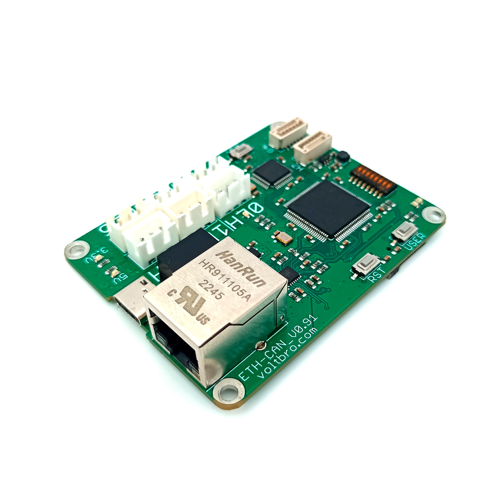
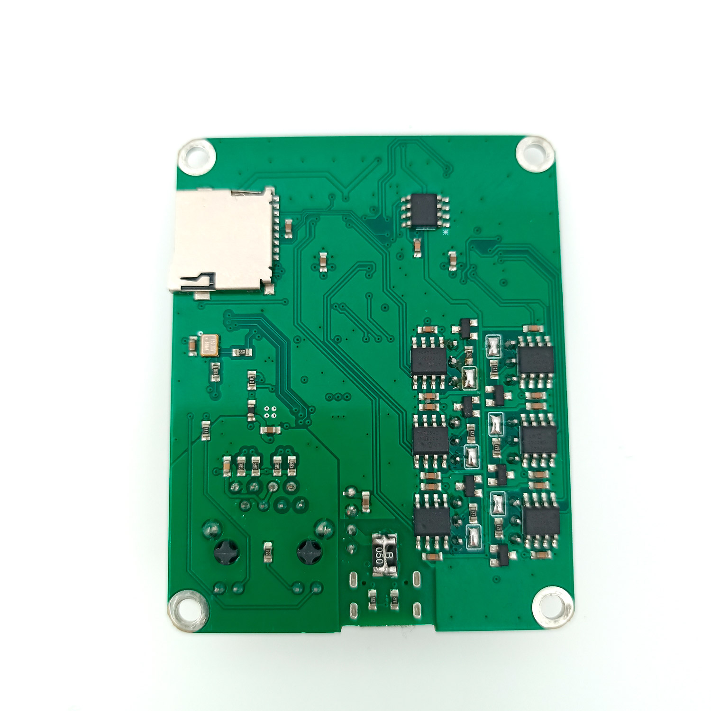

# VBCores Ethernet - CAN FD 

## Overview
A CAN-Ethernet converter is ideal for integrating a robot’s CAN devices with a computer. Firstly, built-in CAN interfaces are rare even in industrial PCs. Secondly, this solution ensures interaction between the upper (computational) and lower (actuation) levels with minimal latency.

The converter simplifies system architecture: a single module serves dozens of CAN nodes via a unified Ethernet network. For example, in autonomous mobile robots (AMRs), it connects motor controllers and sensors to an onboard computer running SLAM algorithms or neural networks. This enables real-time trajectory adjustments based on live sensor data.

Thus, the CAN-Ethernet converter acts as a bridge between low-level (CAN) hardware and high-level software frameworks (ROS, AI), delivering speed, reliability, and scalability for robotic systems.

### Features
- 6x CAN lines 
- Built-in 120Ω terminators with solder pads
- Power via USB-C 
- Wake-On-Line support

### Specs
- **FD CAN bitrate:** up to 8 Mbit/s data rate
  
### Dimensions
- PCB: 71x56 mm
- Mount holes: 65x50 mm D2.5

#### Datasheet

### Development Resources
Software and start-up guide: https://github.com/VBCores/ethernet-can

### Photos

