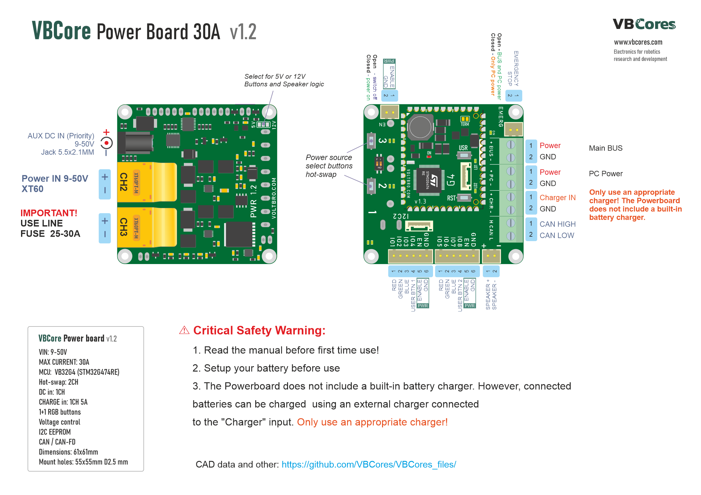
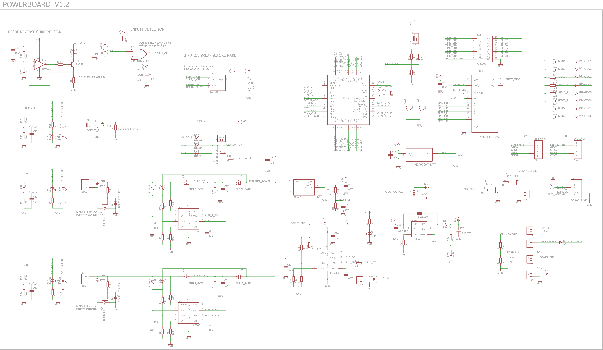
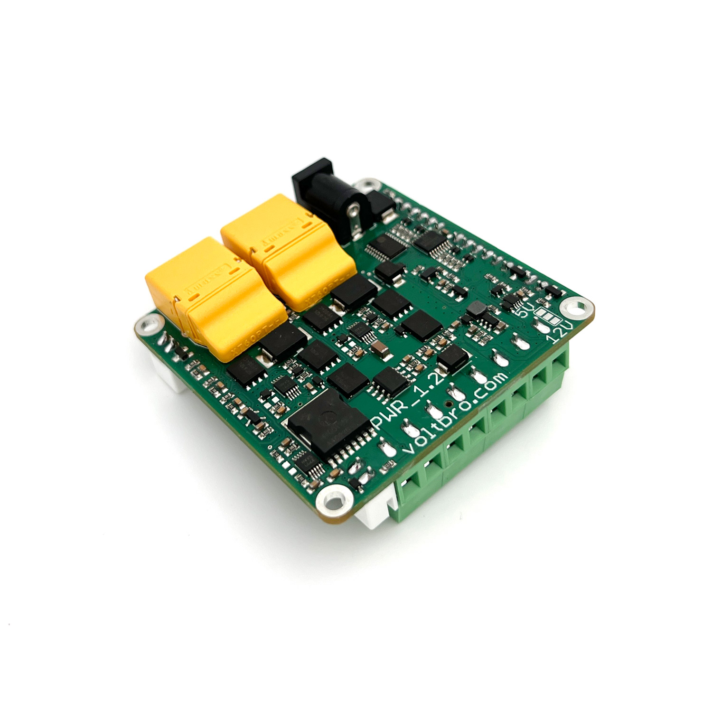
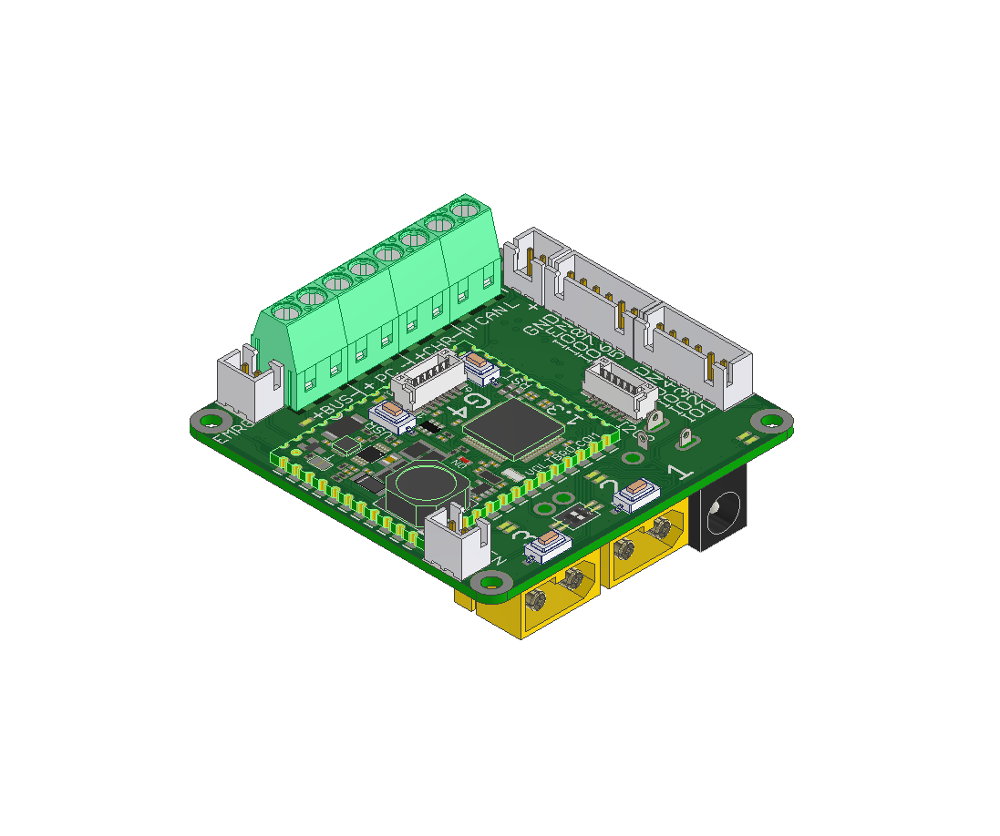
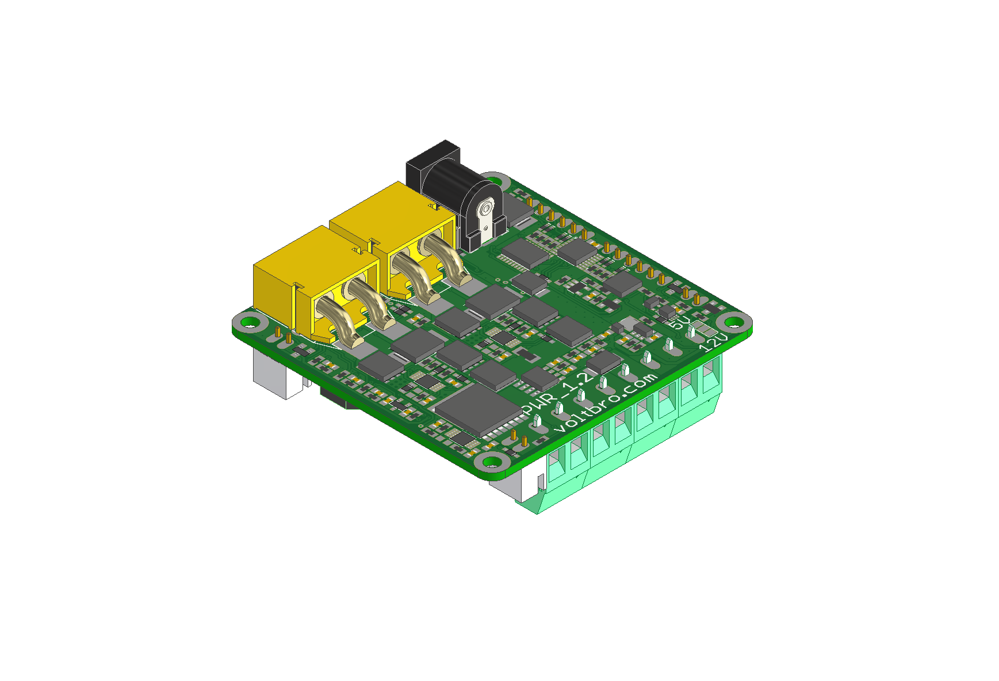
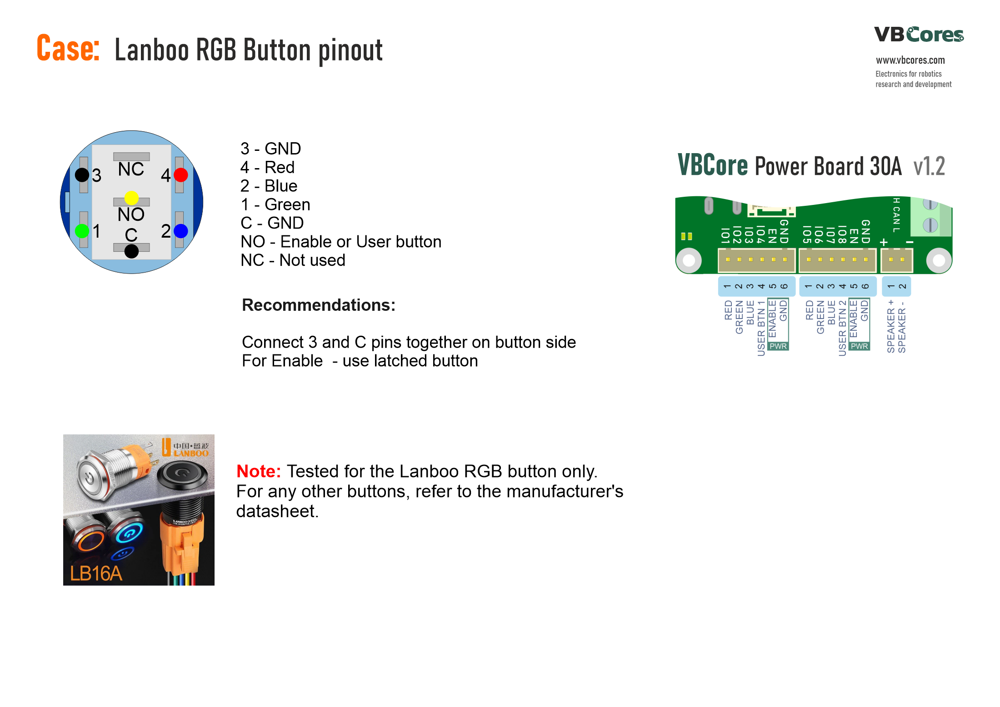

# PowerBoard

## Overview
The VBCores PowerBoard is an advanced solution for powering up your hardware. It provides multiple power inputs, sophisticated protection features, power system status monitoring, and basic user IO.

Based on [VB32G4 controller](https://github.com/VBCores/VBCores_files/tree/main/01-VB-Core32G4) 

## Description

PDF version: [vb-powerboard-v1_2-pinout.pdf](vb-powerboard-v1_2-pinout.pdf)

### Power inputs and outputs
The Powerboard draws power from one of three parallel channels: two "main" high-current inputs and one low-current "auxiliary" channel.
All three channels feature reverse polarity protection. Only one channel can be enabled at a time.

The two main channels support hot-swapping and reverse-current capability, and can be connected to an external charger via the "charger" input. These channels can be prioritized independently of the voltage levels of connected batteries. If two batteries are connected, the priority battery will drain first, and the secondary battery will automatically engage once the priority battery is depleted.

The auxiliary channel is designed for low-power sources (up to 3A) to maintain system operation during main battery replacement. It does not permit reverse current flow. The auxiliary input has the highest priority and, when connected, automatically disables the main channels.

There are two output channels: Bus and PC Bus .

- The Bus includes an emergency stop button that overrides all powerboard software control signals as a safety measure.
- The PC Bus ensures continuous power to the onboard computer, allowing users to diagnose faulty software configurations that may cause unexpected behavior.

The Bus can only be enabled if the PC Bus is active. Disabling the PC Bus will also disable the Bus .

### **Powerboard Charging Notes**  
The Powerboard does not include a built-in battery charger. However, connected batteries can be charged using an external charger connected to the **"Charger" input**.  

⚠️ **Critical Safety Warning** ⚠️  
- **Only use an appropriate charger!**  
- **Voltage and current levels must strictly match the battery specifications!**  

### User IO
8 identical digital input-output channels can be used to drive LEDs and read switches. Each channel is equiped with source type DMOS and Schmitt trigger. PWM supported. Output voltage level is determined by solder jumper and can be either 5V or 12V. 

### Software
Out of the box software implements power and buzzer control only. For detailed description please refer to github repository. 

## Features
- Two 30A and one 3A inputs
- 3A charger input
- Hot swap
- Reverse polarity protection
- Reverse current capability
- Power source prioritization
- Undervoltage and overcurrent protection
- 8 user IO
- Power system state is reported to the computer via FDCAN bus

### Specs
- Up to 50V input voltage
- 30A continuous current, up to 50A peak
- FDCAN bitrate: up to 8 Mbit/s data rate
  
### Dimensions
- PCB: 61x51 mm
- Mount holes: 55x45 mm D2.5

### Schematic

PDF version: [vb-powerboard-v1_2-schematic.pdf](vb-powerboard-v1_2-schematic.pdf)

### Development Resources

### Photos

### 3D model

STEP model: [vb-powerboard-v1_2.stp](vb-powerboard-v1_2.stp)
 
Texture top: [vb-powerboard-v1_2-texture-top.png](vb-powerboard-v1_2-texture-top.png)
 
Texture bottom: [vb-powerboard-v1_2-texture-bottom](vb-powerboard-v1_2-texture-bottom.png)

### Use cases and other

Example of wiring Lanboo RGB buttons. Check carefully led voltage!

PDF version: [cases/lanboo-pinout.pdf](cases/lanboo-pinout.pdf)

