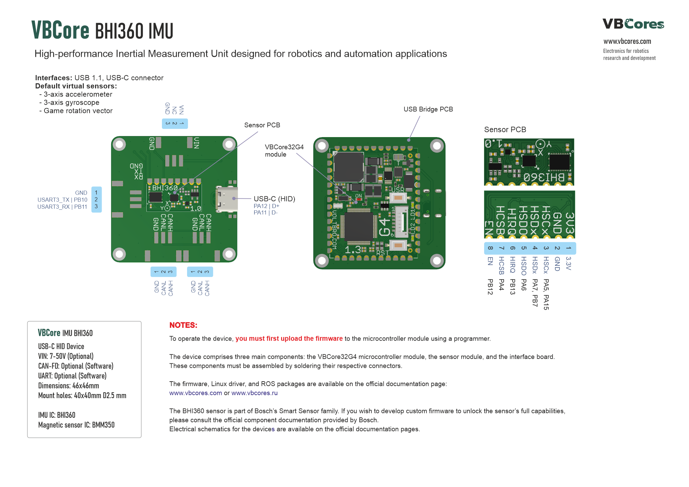
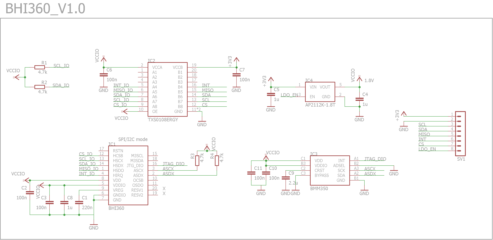
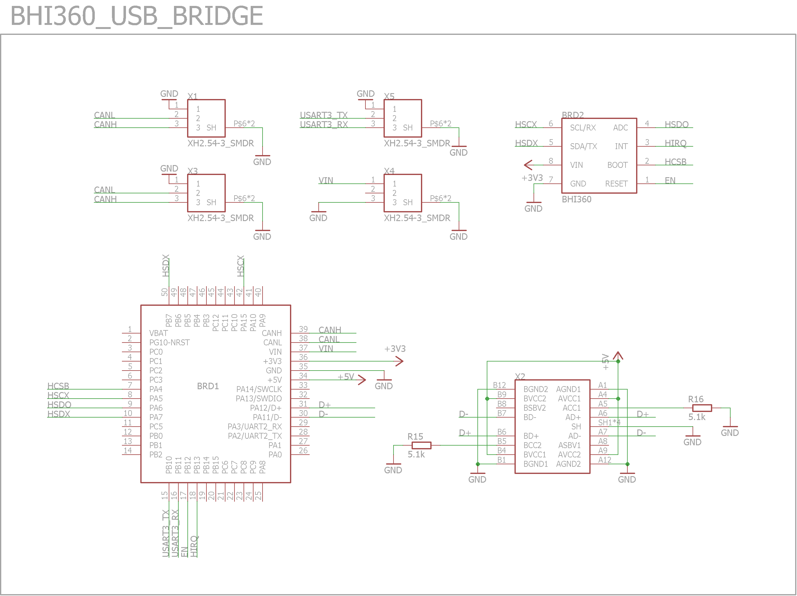
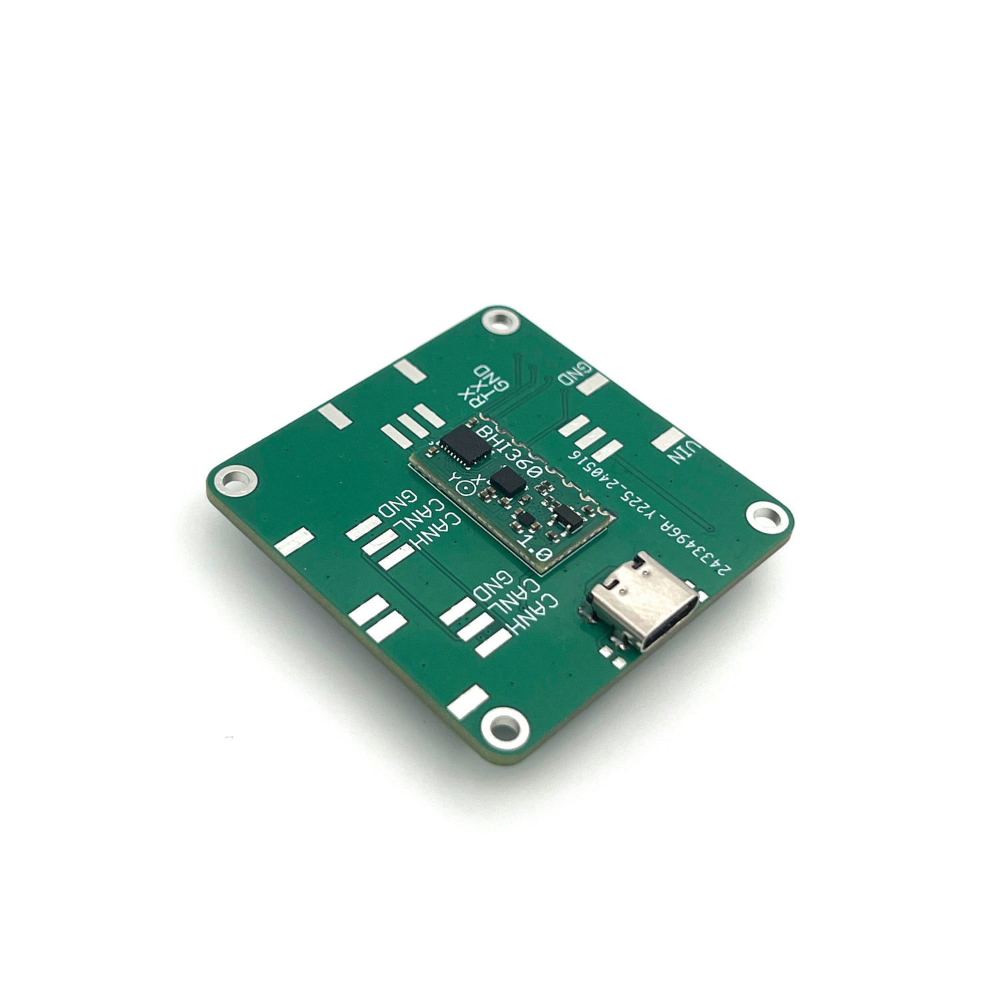
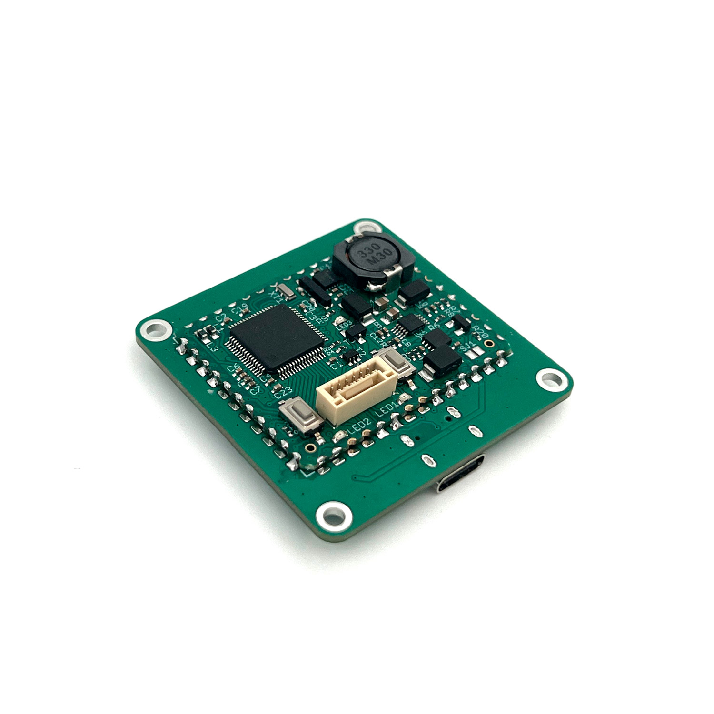
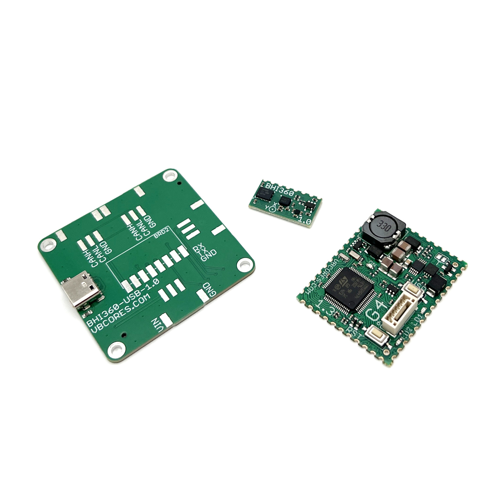
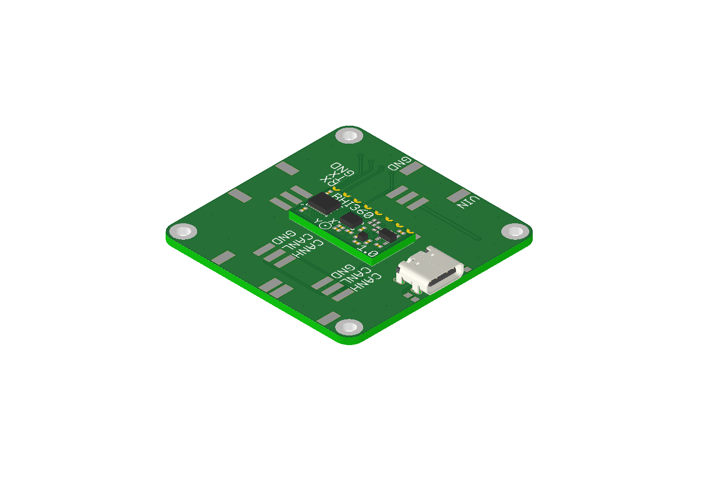
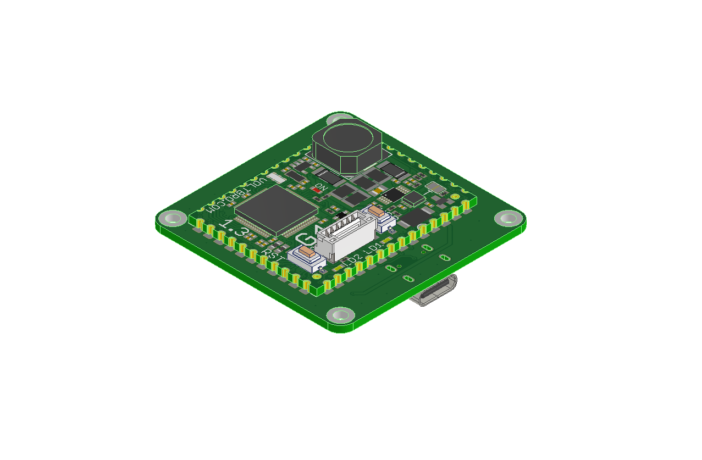

# VBCores BHI360 IMU
## Overview 
The VBCores BHI360 is an advanced 9-DOF Absolute Orientation IMU based on Bosch [BHI360](https://www.bosch-sensortec.com/products/smart-sensor-systems/bhi360/) sensor combining gyroscope and accelerometer and [BMM350](https://www.bosch-sensortec.com/products/motion-sensors/magnetometers/bmm350/) magnetometer. The device comes as a tiny (20 x 10.5mm) solder-on module. The BMM350 is configured as a slave device for the BHI360. The supported interfaces are 3.3V I2C or SPI.
The most important part of the IMU is the software running raw sensors data processing. Bosch provides [Sensor fusion software (BSX)](https://www.bosch-sensortec.com/media/boschsensortec/downloads/application_notes_1/bst-bhi260_bhi360-an002.pdf) framework which runs on the BHI360 and integrates data from different sensor sources, mitigating the limitations of individual sensors, such as noise, bias, and drift, thereby offering a more reliable information. Communication with the BSX is possible with the help of [BHy2 SensorAPI](https://github.com/boschsensortec/BHY2_SensorAPI). Unfortunately, it's build around Bosch [COINES SDK](https://www.bosch-sensortec.com/software-tools/tools/coines/) and cannot be run directly on Arduino or STM32. For Arduino, we recommend using [SensorLib](https://github.com/lewisxhe/SensorLib), example of STM32 application can be found on our [github](https://github.com/Dmivaka/STM32-HAL-BHI360).
Since I2C and SPI are not very common on powerfull x86 computers, we also developed USB bridge which handles all the stuff related to communication with the sensor and works as a USB device. It's fully compliant with USB HID Sensor specification and works in plug-and-play fashion on all modern OS.

## VB IMU Module (Assembled)
 

## Sensor Features
- **Supply voltage**: 3.3V
- **Interfaces:**
	- I2C (up to 3.4 MHz)
	- SPI (up to 50 MHz)
- **Available virtual sensors:**
	- 3-axis accelerometer 	(16 bit)
	- 3-axis gyroscope (16 bit)
	- 3-axis magnetometer (	16 bit)
	- Gravity vector
	- Rotation vector
	- Game rotation vector
	- Geo-magnetic rotation vector
	- Orientation quaternion

### Dimensions
- PCB: 20 x 10.5mm

### Sensor Schematic

## USB Bridge Features
- **Interfaces:** USB 1.1, USB-C connector
- **Default virtual sensors:**
	- 3-axis accelerometer
	- 3-axis gyroscope
	- Game rotation vector

### Dimensions
- PCB: 46x46 mm
- Mount holes: M2.5 40x40 mm 

### USB Bridge Schematic

### VBCore32G4 module
[VBCore32G4 controller page](https://github.com/VBCores/VBCores_files/tree/main/01-VB-Core32G4) 

### SWD Interface

JST GH1.25, 6pin

| Pin      | Is           | 
| -------- | -------------|
| 1        | GND          |
| 2        | 5V           |
| 3        | SWCLK        |
| 4        | SWDIO        |
| 5        | TX USART2    |
| 6        | RX USART2    |

### Development Resources

### Photos

### 3D model
STEP model: [vb-imu-bhi360-asm.stp](vb-imu-bhi360-asm.stp)

