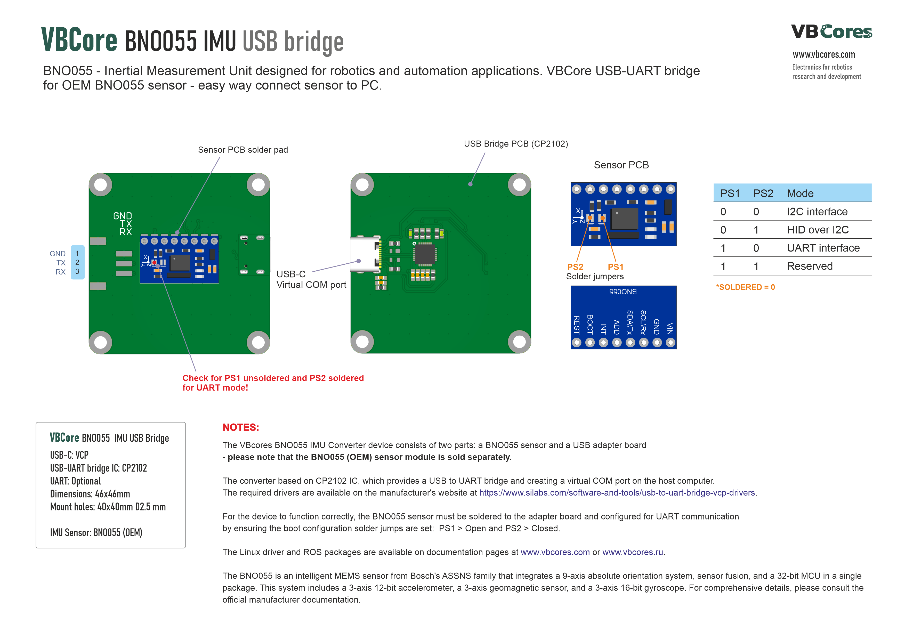
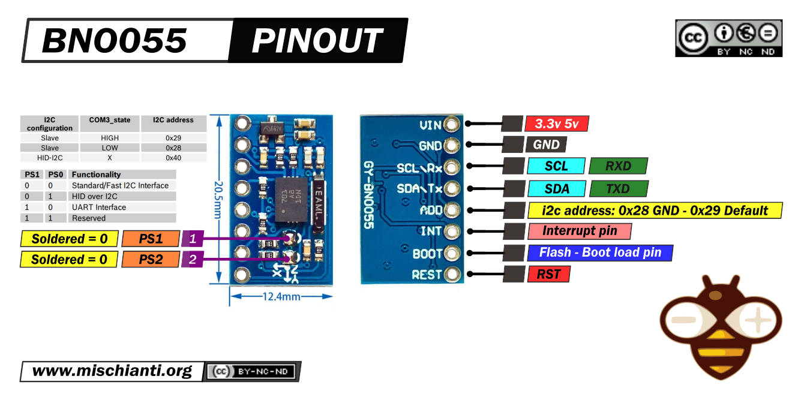
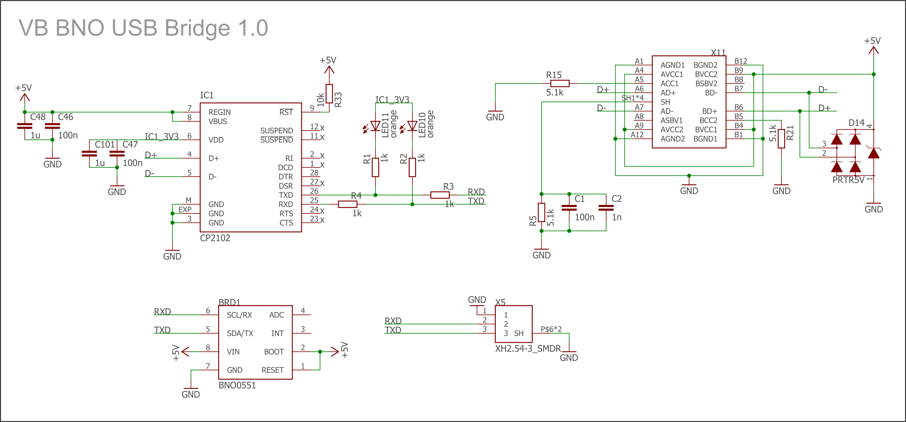
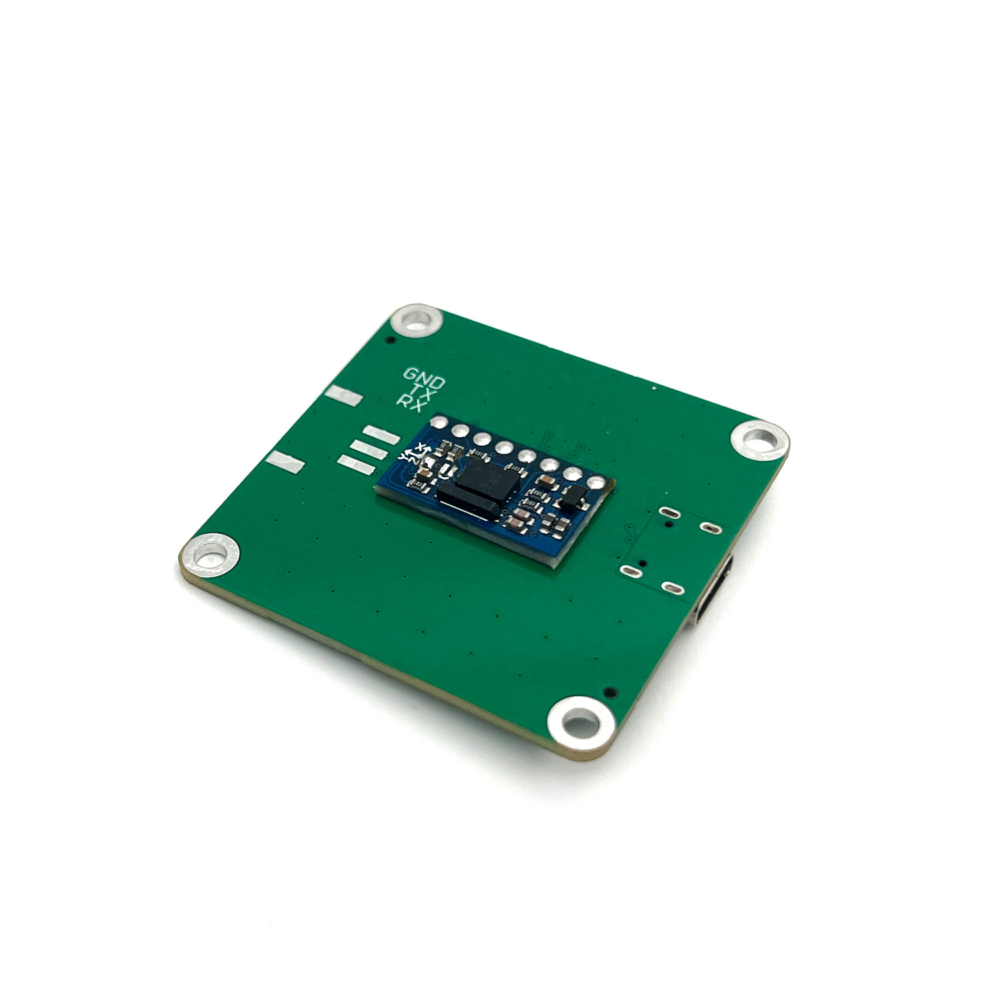
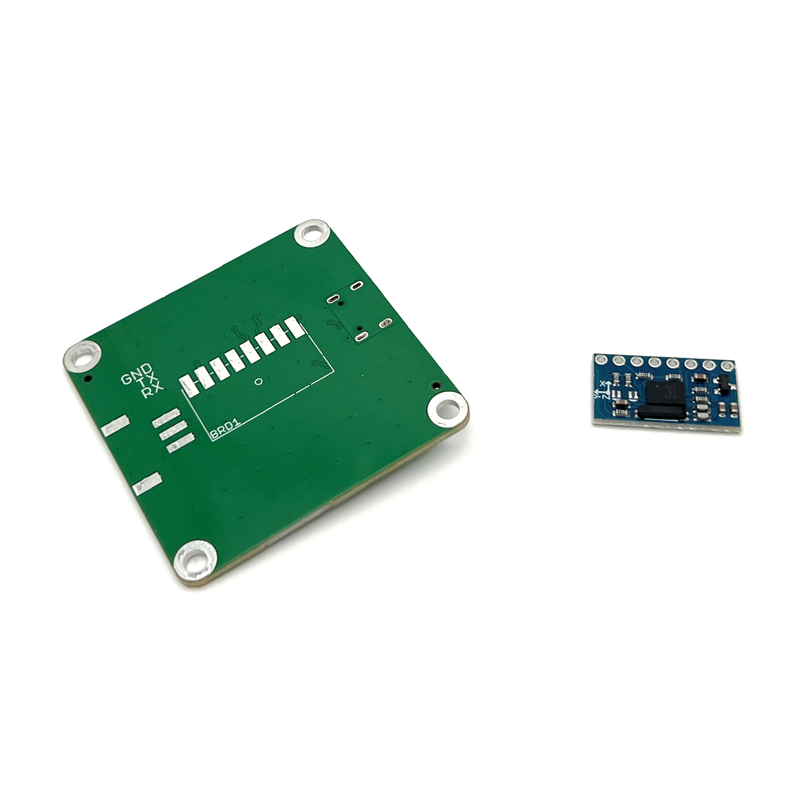
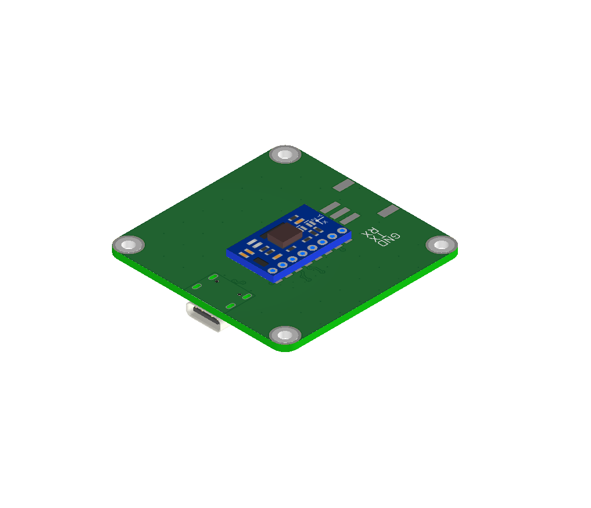
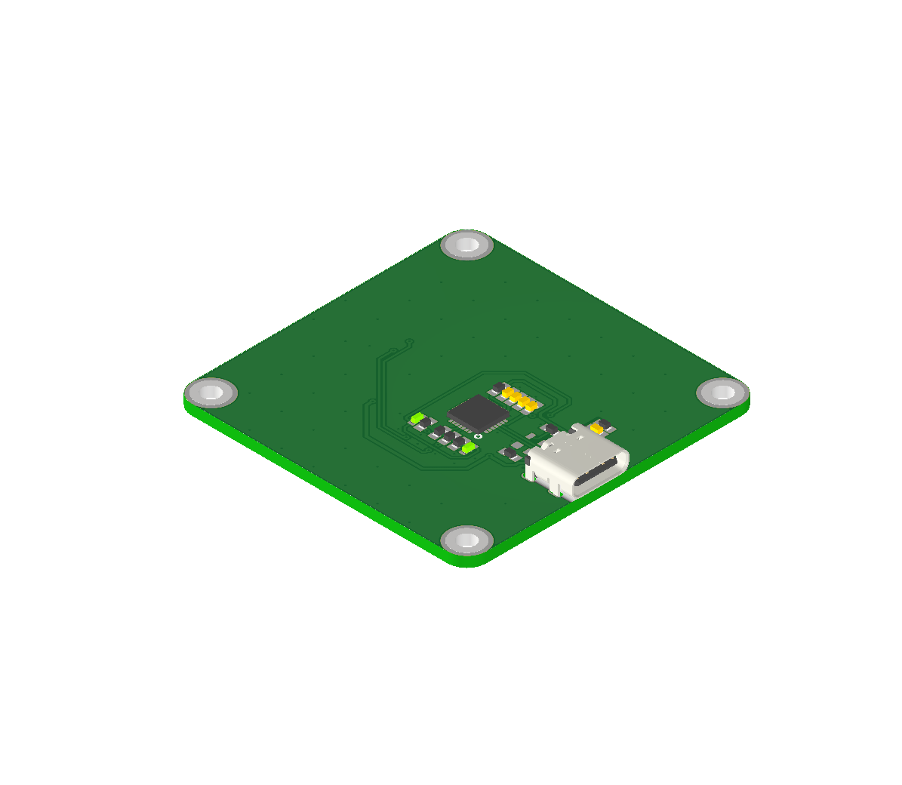

# VBCores IMU BNO055 USB-UART Bridge

## Overview 
VBCores IMU BNO055 USB-UART Bridge is a convenient adapter board if you need to connect the popular OEM BNO055 sensor to your robot via USB. 

The VBcores BNO055 IMU Converter device consists of two parts: a BNO055 sensor and a USB adapter board.
<b>Please note that the BNO055 (OEM) sensor module is sold separately.</b> 

The converter based on CP2102 IC, which provides a USB to UART bridge and creating a virtual COM port on the host computer. 
The required drivers are available on the manufacturer's website at https://www.silabs.com/software-and-tools/usb-to-uart-bridge-vcp-drivers. 

For the device to function correctly, the BNO055 sensor must be soldered to the adapter board and configured for UART communication 
by ensuring the boot configuration solder jumps are set:  PS1 > Open and PS2 > Closed. 

The Linux driver and ROS packages are available on documentation pages at www.vbcores.com or www.vbcores.ru. 

## VB IMU Module (Assembled)
 

## Sensor Features
The BNO055 is a System in Package (SiP), integrating a triaxial 14-bit accelerometer, a triaxial 16-bit gyroscope with a range of ±2000 degrees per second, a triaxial geomagnetic sensor and a 32-bit cortex M0+ microcontroller running Bosch Sensortec sensor fusion software, in a single package.  For comprehensive details, please read the official manufacturer documentation.
Sensor sold separetly on popular marketplaces.

### Dimensions
- PCB: 20 x 10.5mm

### Sensor Schematic

## USB Bridge Features
- **Interfaces:** USB 1.1, USB-C connector

### Dimensions
- PCB: 46x46 mm
- Mount holes: M2.5 40x40 mm 

### USB Bridge Schematic

### Development Resources
BNO055 read serial: https://github.com/VBCores/bno055-serial

### Photos

### 3D model
STEP model: [vb-imu-bno055-asm.stp](vb-imu-bno055-asm.stp)

