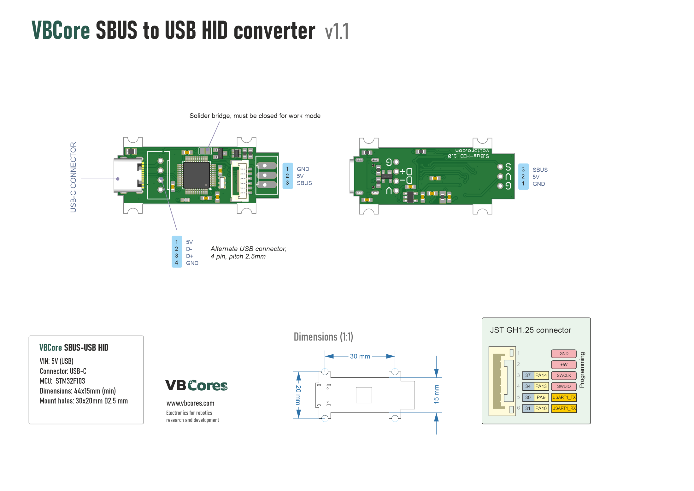
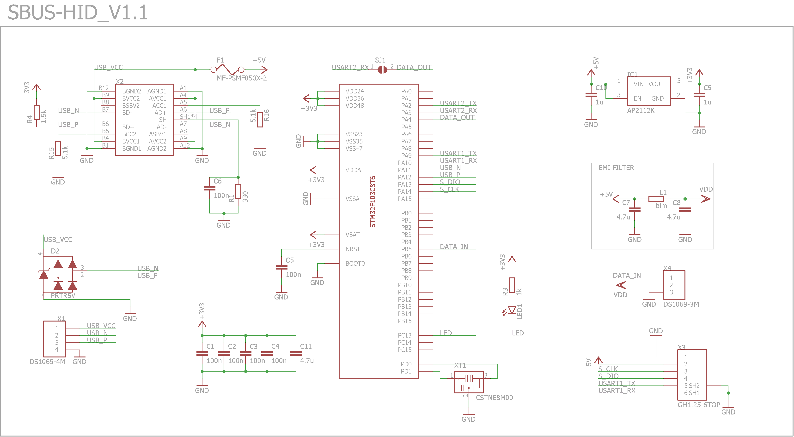
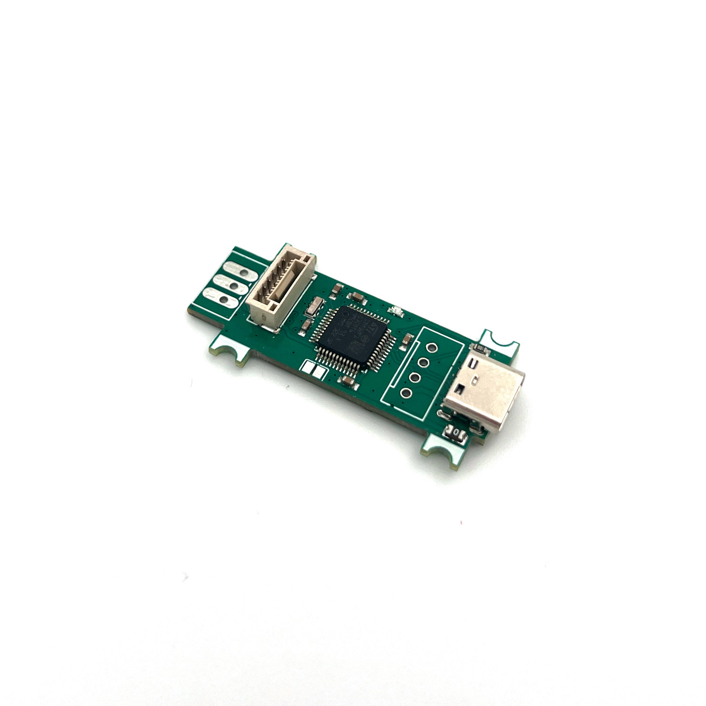
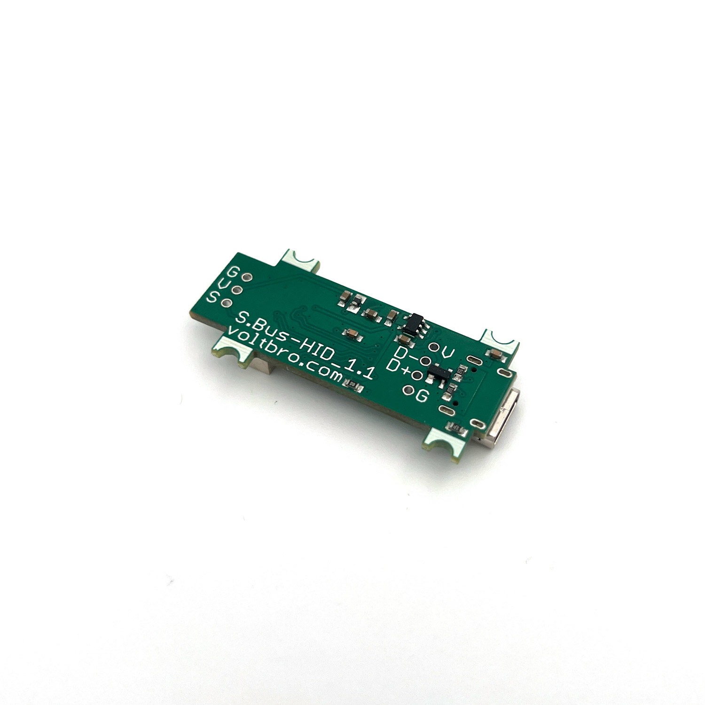
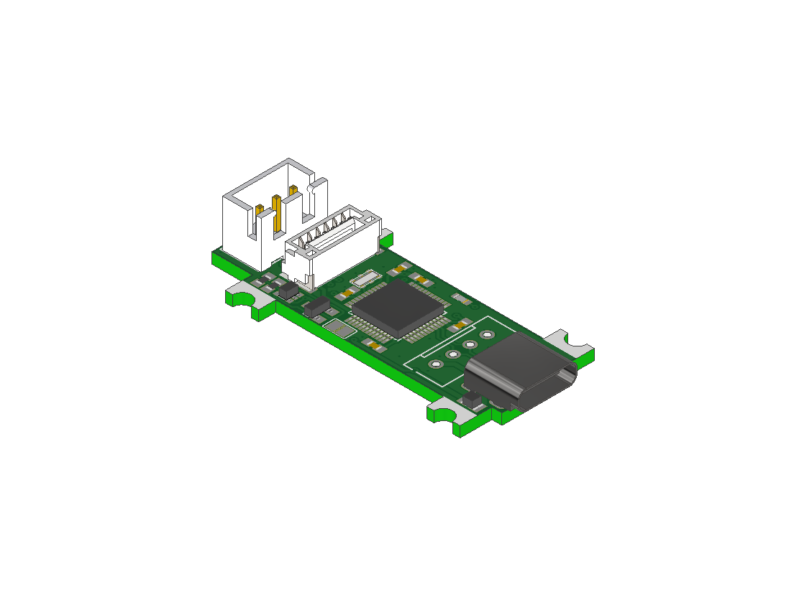
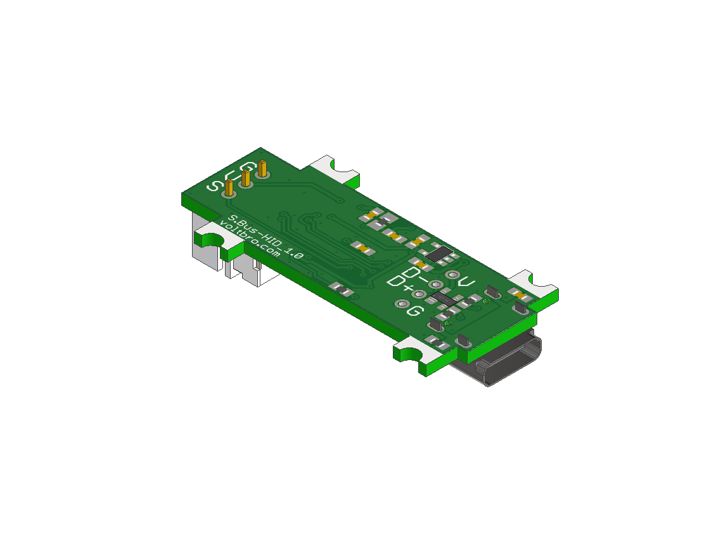

# VBCores SBUS-HID bridge v1.1
## Overview
Need to control a robot without being tied to a WIFI or LTE network? Prefer good old joysticks instead of laptop keys? This device allows you to easily connect an SBus RC receiver to a computer via a USB bus. The signal from the receiver is converted into USB HID Gamepad reports. Up to 8 analog channels are supported. The HID Gamepad can be interfaced with ROS, and the customizable axis mapping provides a flexible solution for controlling a variety of robots.
The device runs fork of open-source **[Universal-RC-Joystick](https://github.com/VBCores/8-Axis-Universal-RC-Joystick)** firmware. 

### Features
- **MCU** STM32F103C8T6
- **Interfaces:**
	- USB 1.1 device with USB-C connector
	- SBus up to 8 channels

###  Dimensions
- PCB: 20x42.5mm
- Mount holes: M2.5 20x30 mm

### Pinout

PDF version: [vb-sbus-hid-v1_1-pinout.pdf](vb-sbus-hid-v1_1-pinout.pdf)

### Schematic

PDF version: [vb-sbus-hid-v1_1-schematic.pdf](vb-sbus-hid-v1_1-schematic.pdf)

### SWD Interface

JST GH1.25 6pin

| Pin      | Is           | 
| -------- | -------------|
| 1        | GND          |
| 2        | 5V           |
| 3        | SWCLK        |
| 4        | SWDIO        |
| 5        | TX USART1    |
| 6        | RX USART1    |

### Development Resources

Firmware: https://github.com/VBCores/8-Axis-Universal-RC-Joystick

### Photos

### 3D model
STEP model: [vb-sbus-hid_v1_1.stp](vb-sbus-hid_v1_1.stp)

