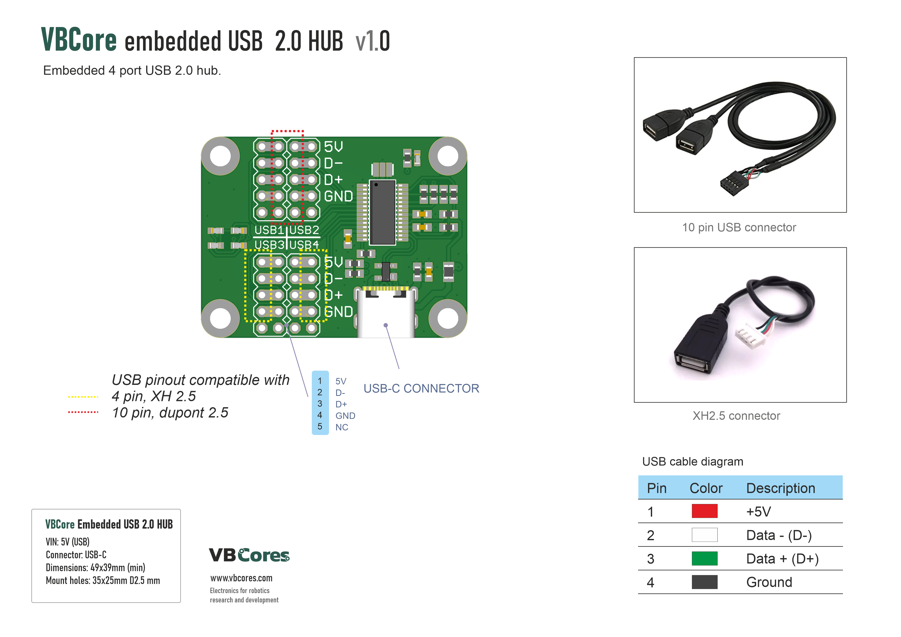
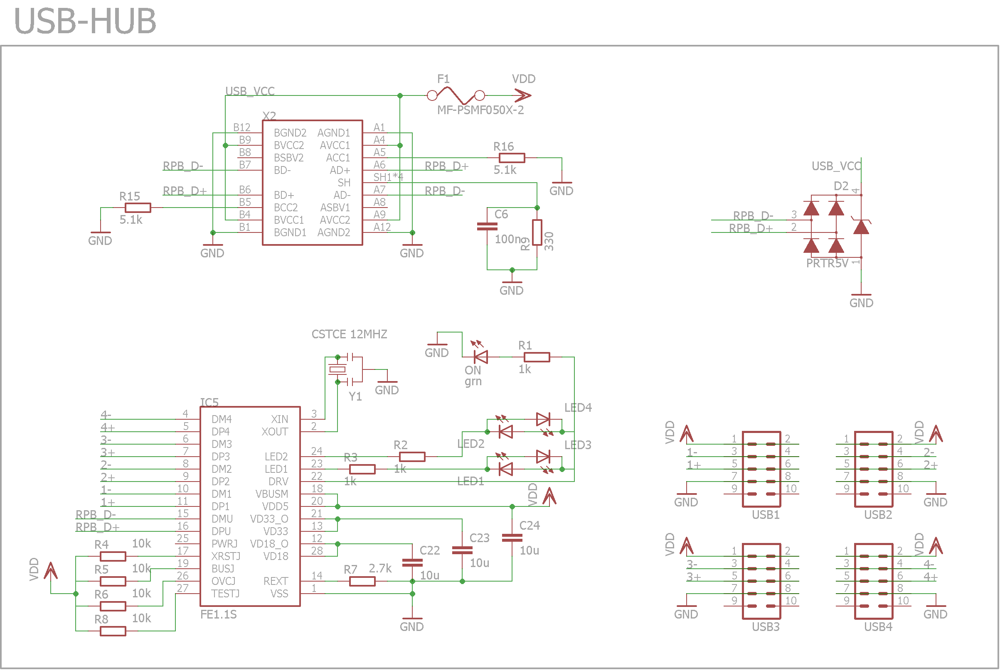
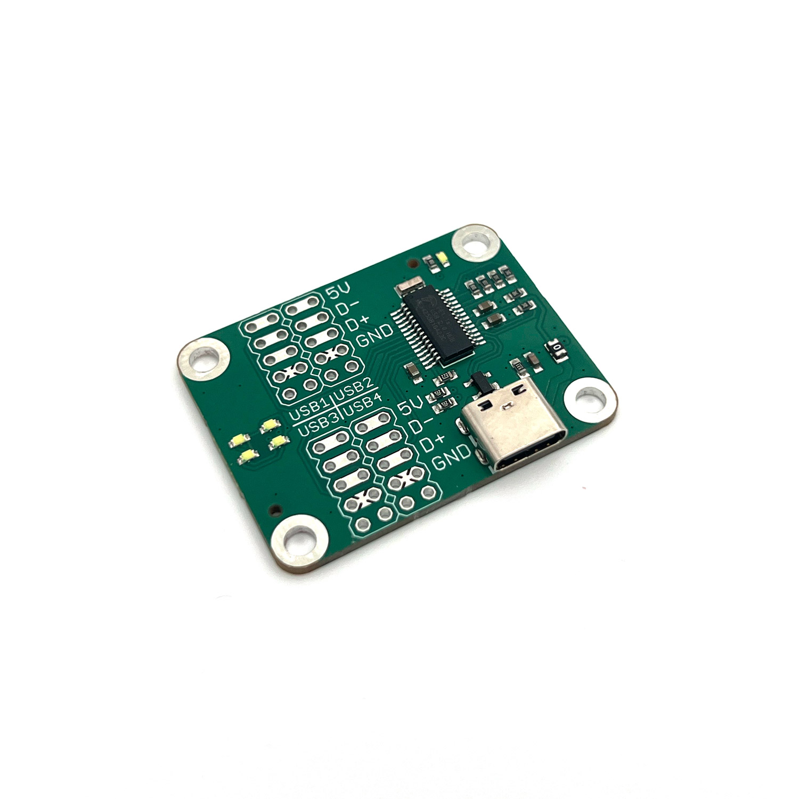
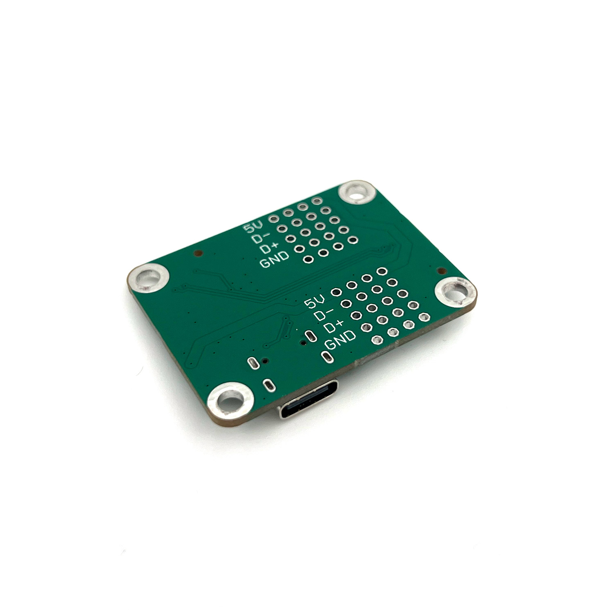
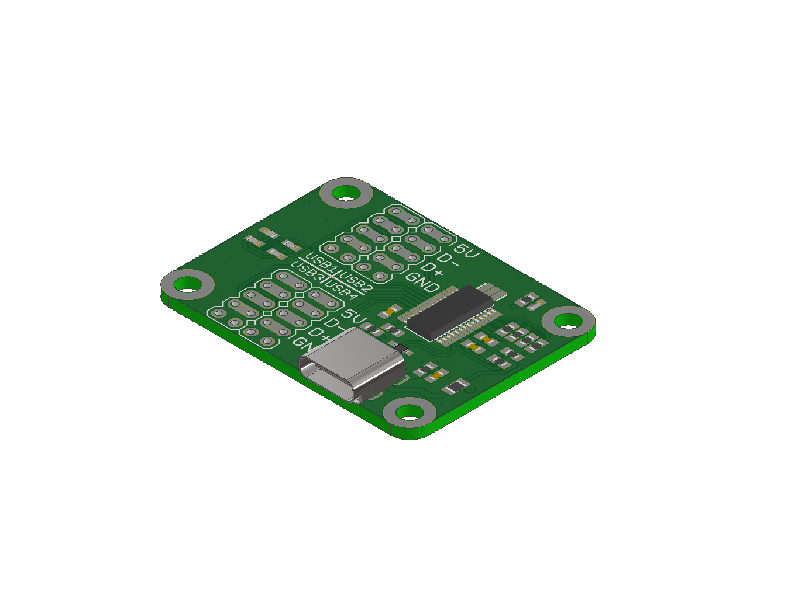
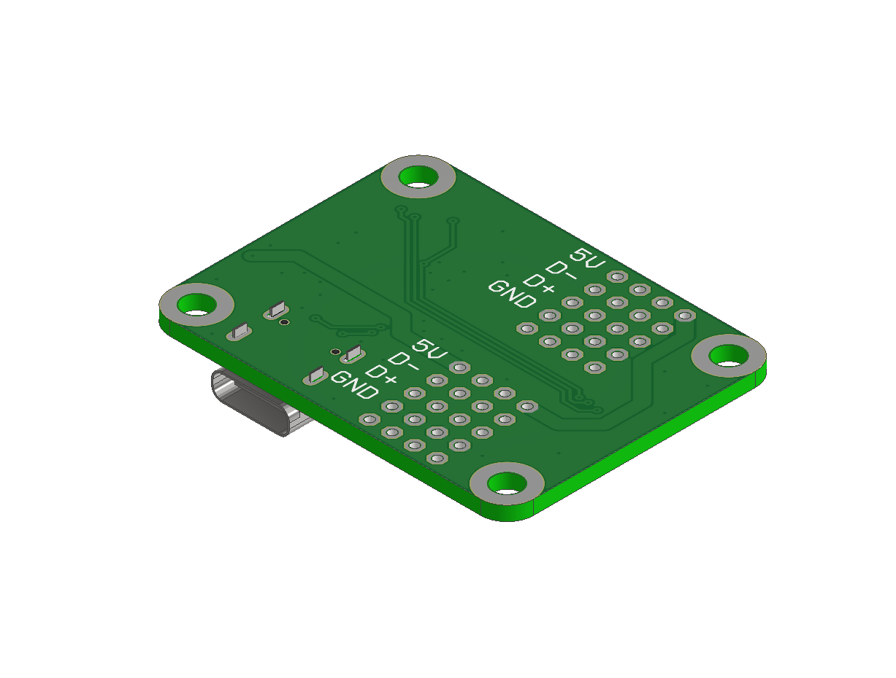

# VBCores USB hub
## Overview
Compact 4-port USB-hub for permanent connection of robot's USB-devices to OBC. Upstream port has USB-C connector. Downstream ports are wired according to [DN2800MT-2.2.3.5](https://resources.mini-box.com/online/MBD-I-DN2800MT/MBD-I-DN2800MT-manual.pdf), one connector per port (parallel lines). 

### Features
- **Chip** FE1.1s
- **Interfaces:**
	- USB 2.0 upstream port with USB-C connector, TVS protection
	- 4 USB 2.0 downstream ports
- 5 activity LEDs

### Dimensions
- PCB: 41x31 mm
- Mount holes: M2.5 35x25 mm

### Pinout

PDF version: [vb-int-usb-hub-pinout.pdf](vb-int-usb-hub-pinout.pdf)

### Schematic

PDF version: [vb-sbus-hid-v1_1-pinout.pdf](vb-int-usb-hub-schematic.pdf)

### Photos

### 3D model
STEP model: [vb-int-usb-hub.stp](vb-int-usb-hub.stp)
 
Texture top: [vb-int-usb-hub-texture-top.png](vb-int-usb-hub-texture-top.png)
 
Texture bottom: [vb-int-usb-hub-texture-bottom.png](vb-int-usb-hub-texture-bottom.png)

