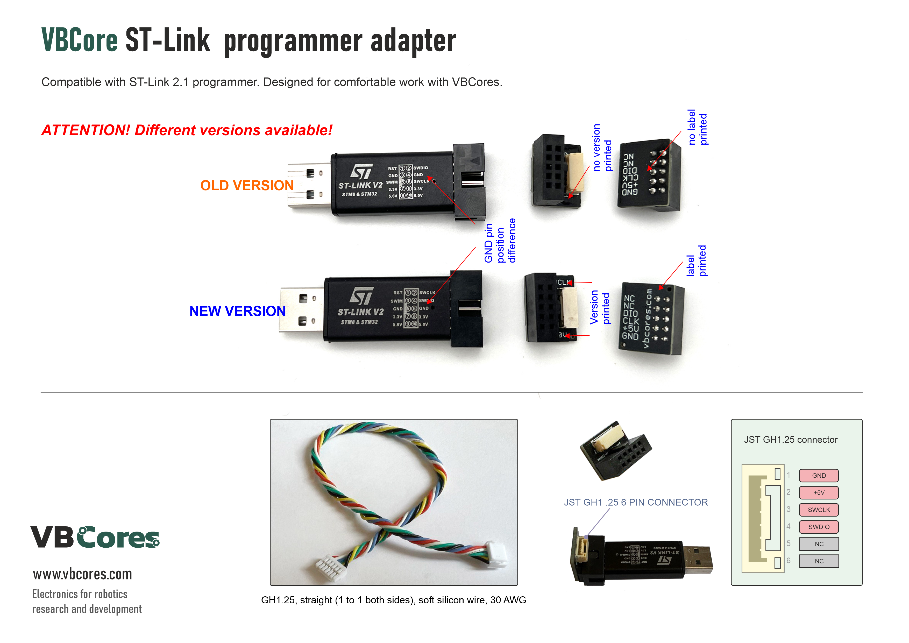
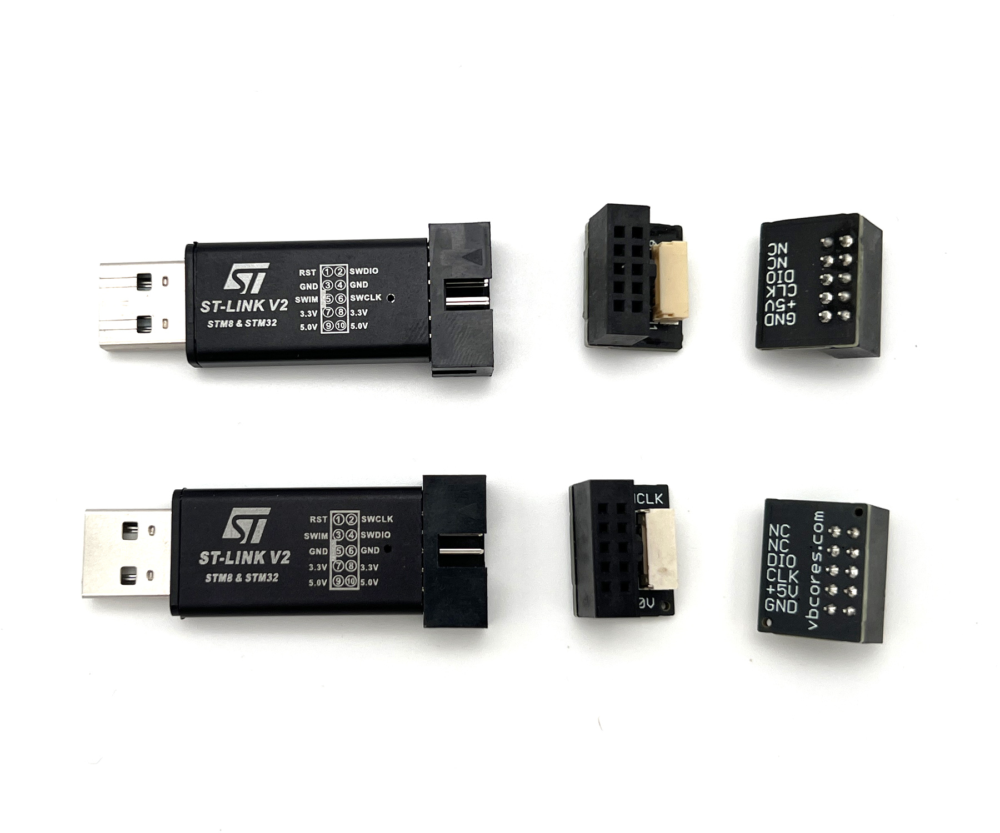
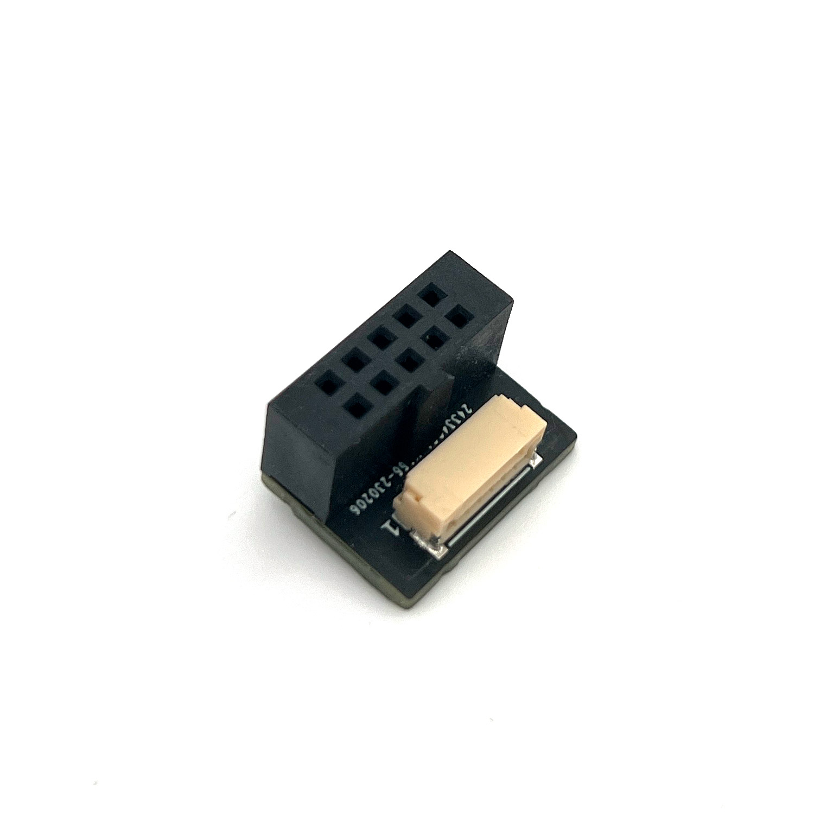
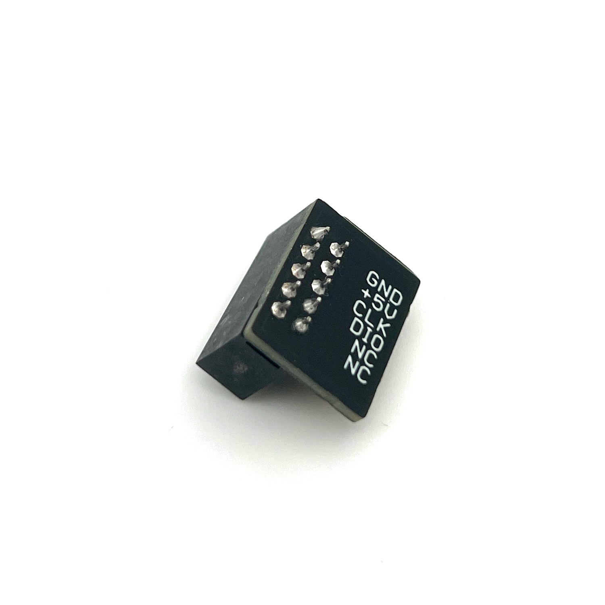

# VBCores ST-Link programmer adapter

 Designed for comfortable work with VBCores.  Compatible with ST-Link 2.1 programmer.

<b> 
ATTENTION! Different versions available!
</b>
<b>
- On NEW version GND in the middle on 5 and 6 pins. 
- On OLD version GND in the 3 and 6 pins.
</b>

### Features
 - Compact design
 - GH1.25 straight cable 

### Dimensions
- PCB: 20x18 mm

### Pinout

PDF version: [vb-stlink-adapter.pdf](vb-stlink-adapter.pdf)

### Photos

