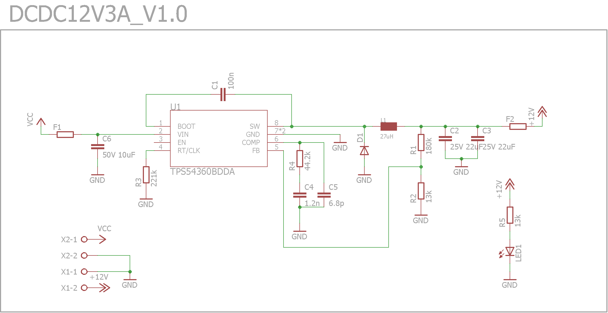

# VBCores 12V3A DCDC
## Overview
Efficient 12V 3A DCDC converter for powering on-board computer and low-voltage devices. Input voltage up to 50V. Both input and output are fused. 

### Features
- **IC** [TPS54360B ](https://www.ti.com/product/TPS54360B)
- **Input**: 15-50V
- **Output**: 12V 3A

### Dimensions
- PCB: 
	- With mounting brackets: 36x36 mm
	- Without mounting brackets: 36x22 mm
- Mount holes: M3 30x30 mm

### Schematic
