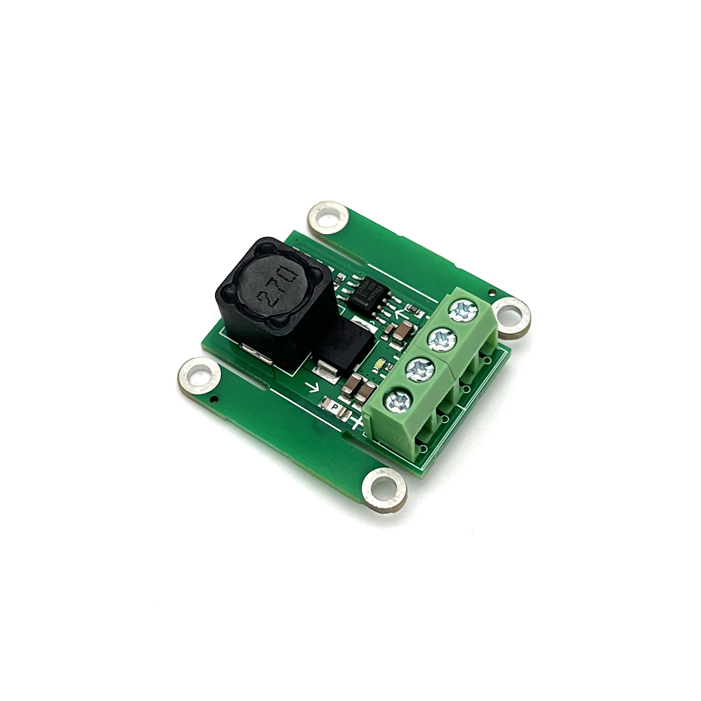
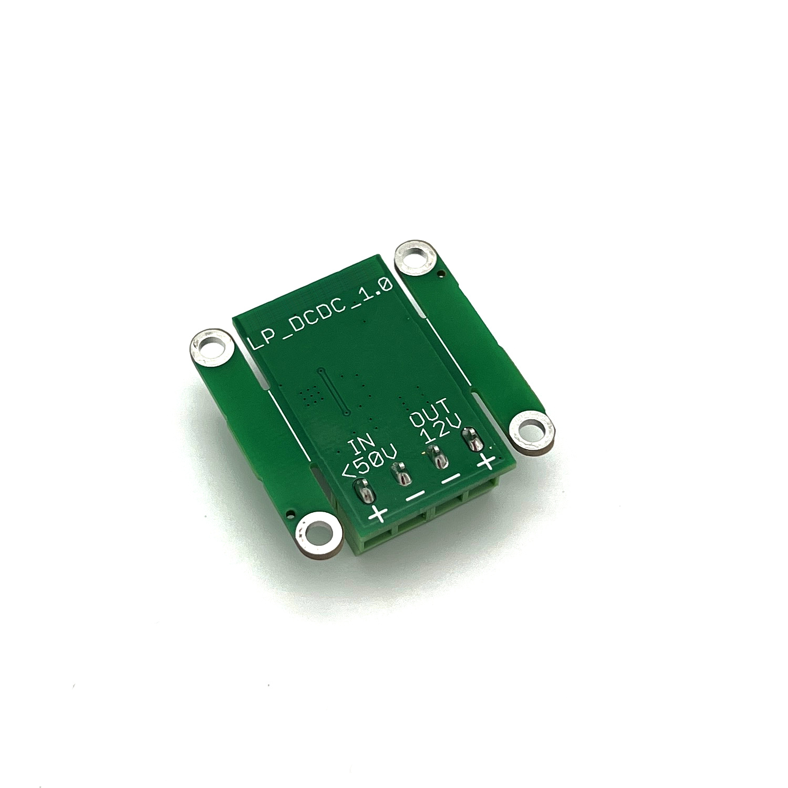
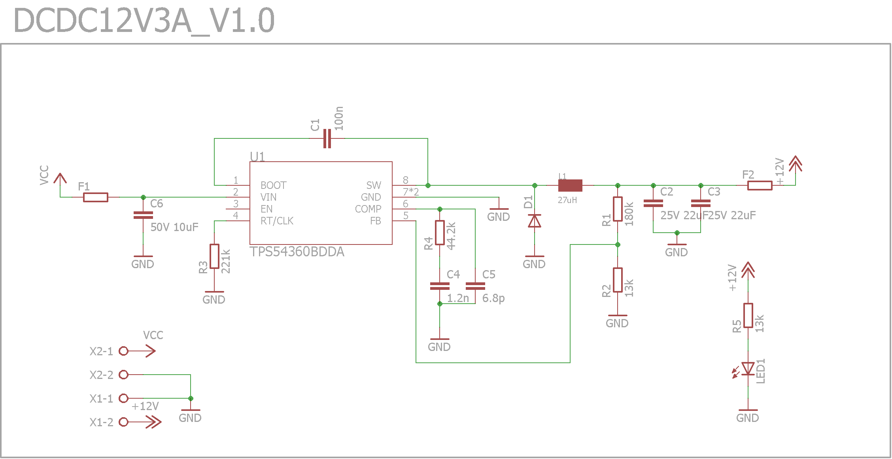
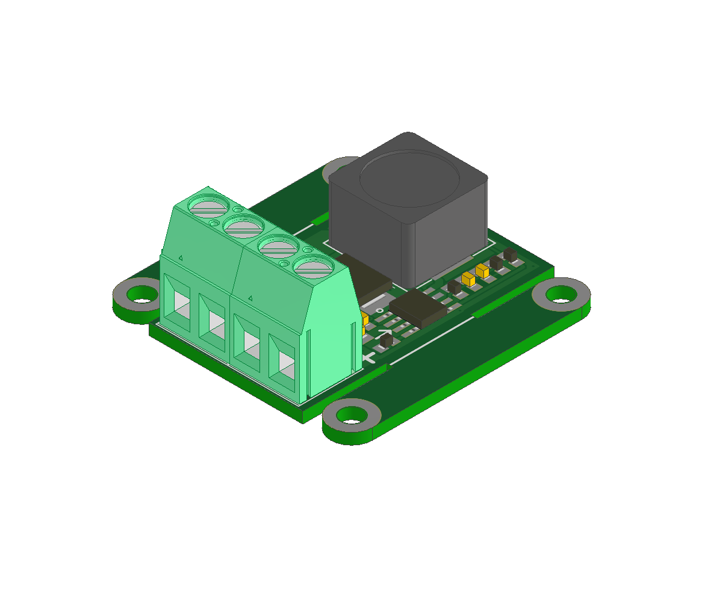
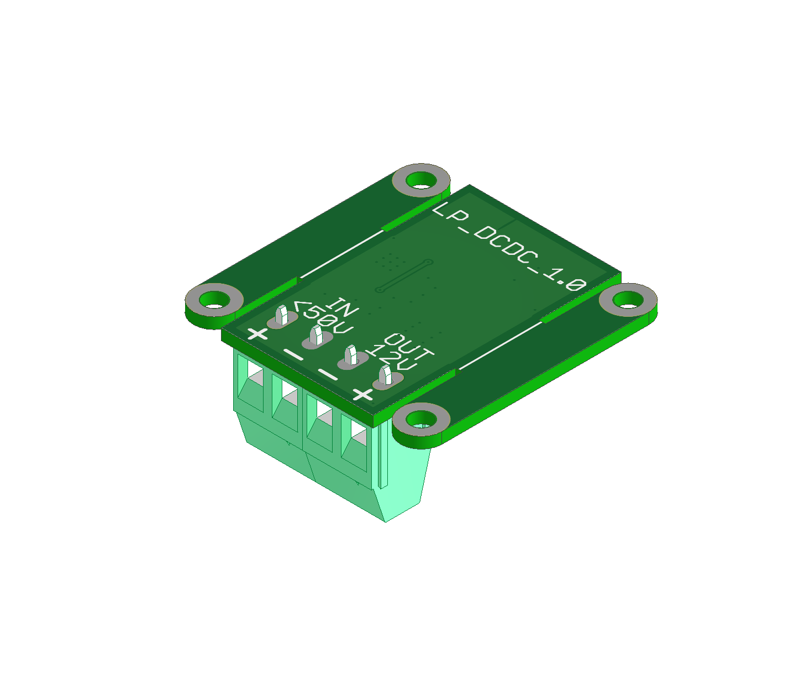

# VBCores 12V3A DCDC
## Overview
Efficient 12V 3A DCDC converter for powering on-board computer and low-voltage devices. Input voltage up to 50V. Both input and output are fused. 

### Features
- **IC** [TPS54360B ](https://www.ti.com/product/TPS54360B)
- **Input**: 15-50V
- **Output**: 12V 3A

### Photos

### Dimensions
- PCB: 
	- With mounting brackets: 36x36 mm
	- Without mounting brackets: 36x22 mm
- Mount holes: M3 30x30 mm

### Schematic

PDF version: [vb-dcdc12v3a-v1_0-schematic.pdf](vb-dcdc12V3A-v1_0-schematic.pdf)

### 3D model

STEP model: [vb-dcdc12v3a-v1_0.stp](vb-dcdc12v3a-v1_0.stp)
 
Texture top: [vb-dcdc12v3a-v1_0-texture-top.png](vb-dcdc12v3a-v1_0-texture-top.png)
 
Texture bottom: [vb-dcdc12v3a-v1_0-texture-bottom](vb-dcdc12v3a-v1_0-texture-bottom.png)

