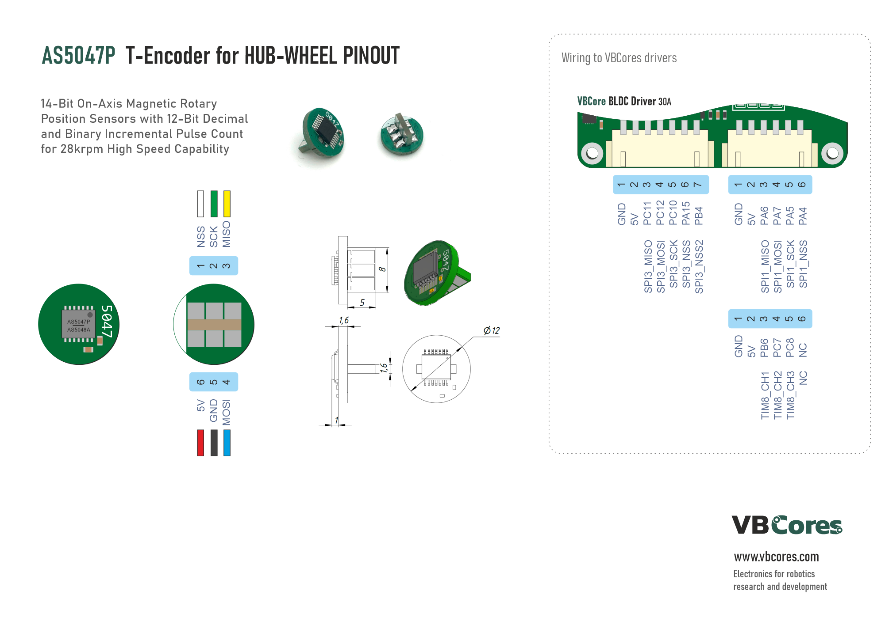
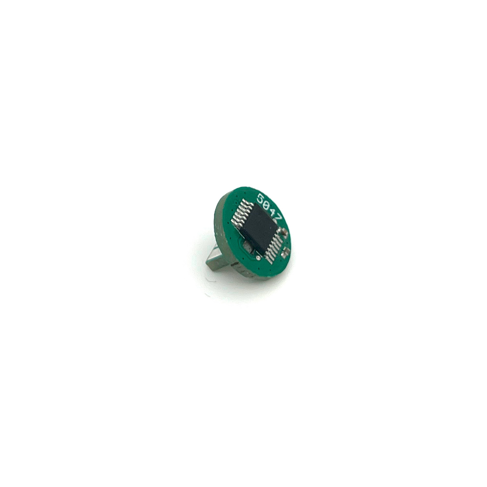
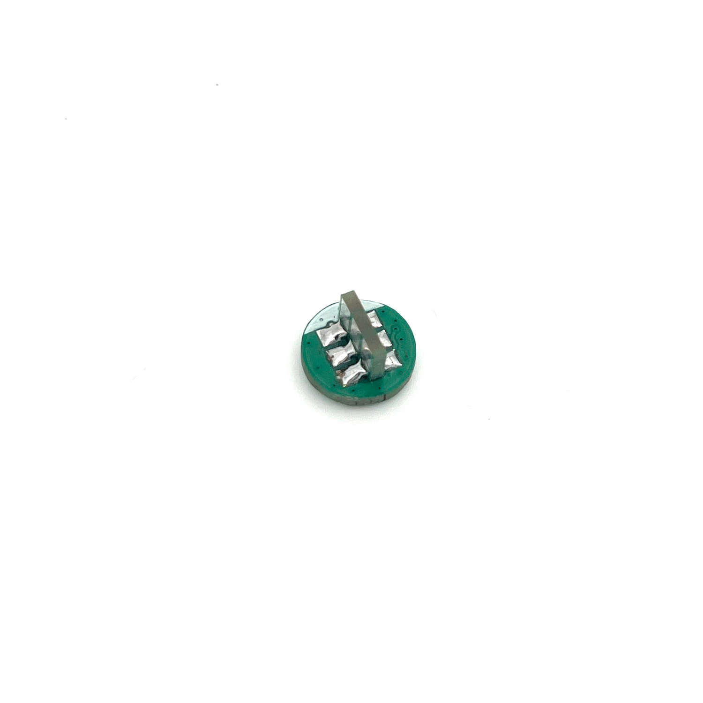
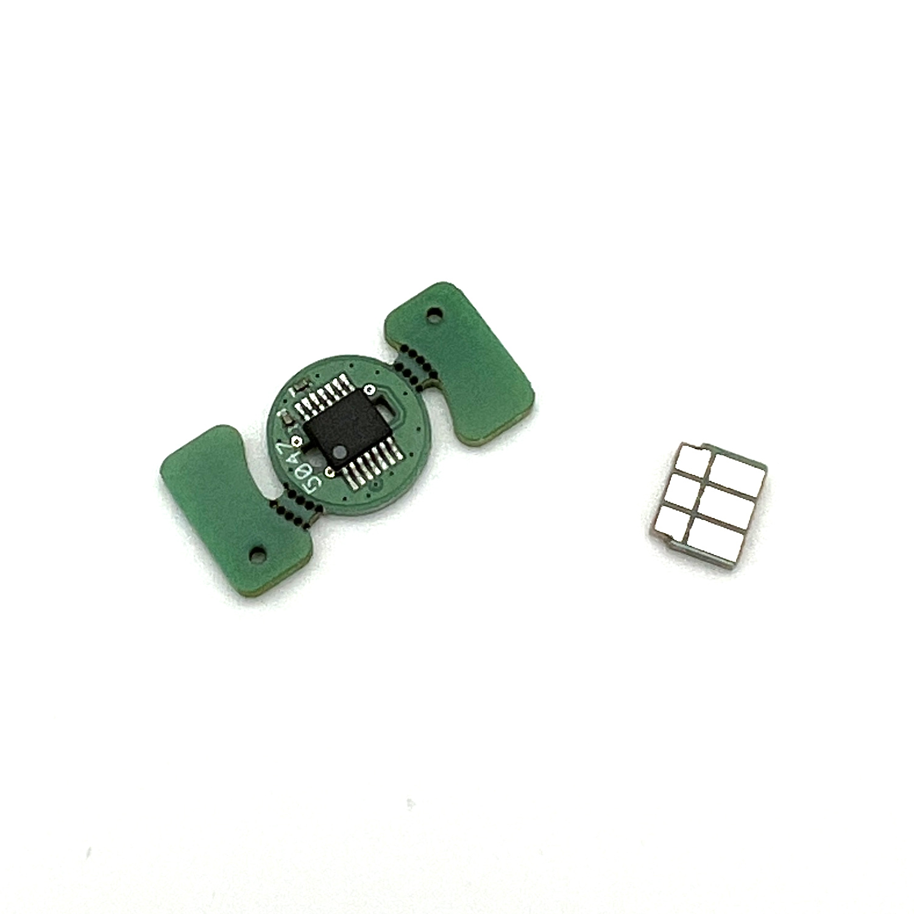
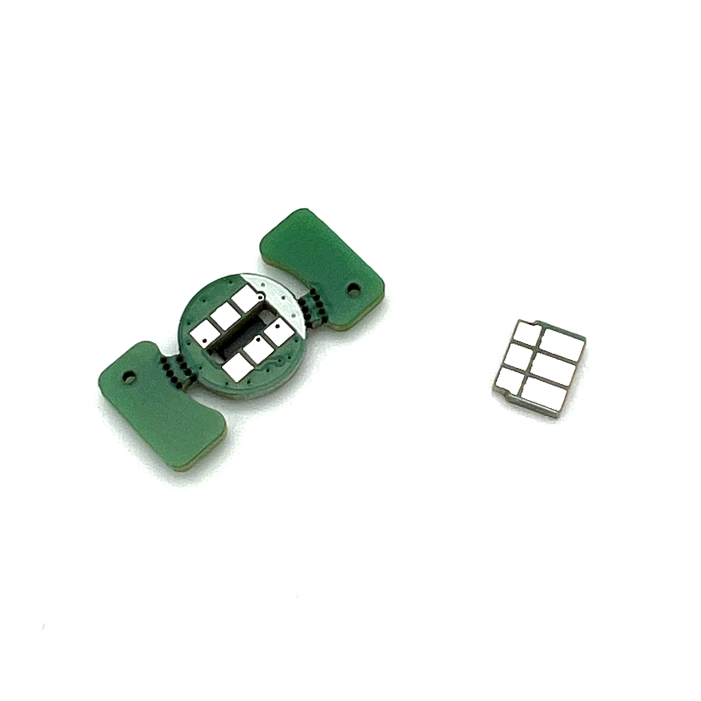
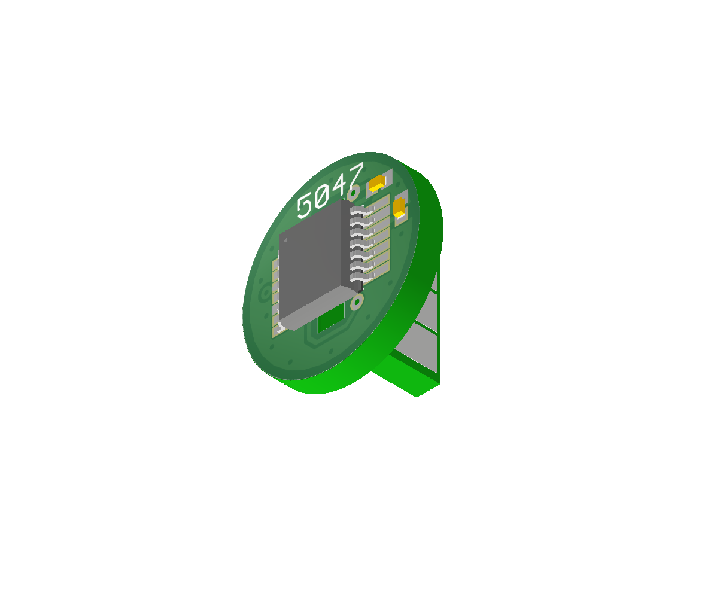
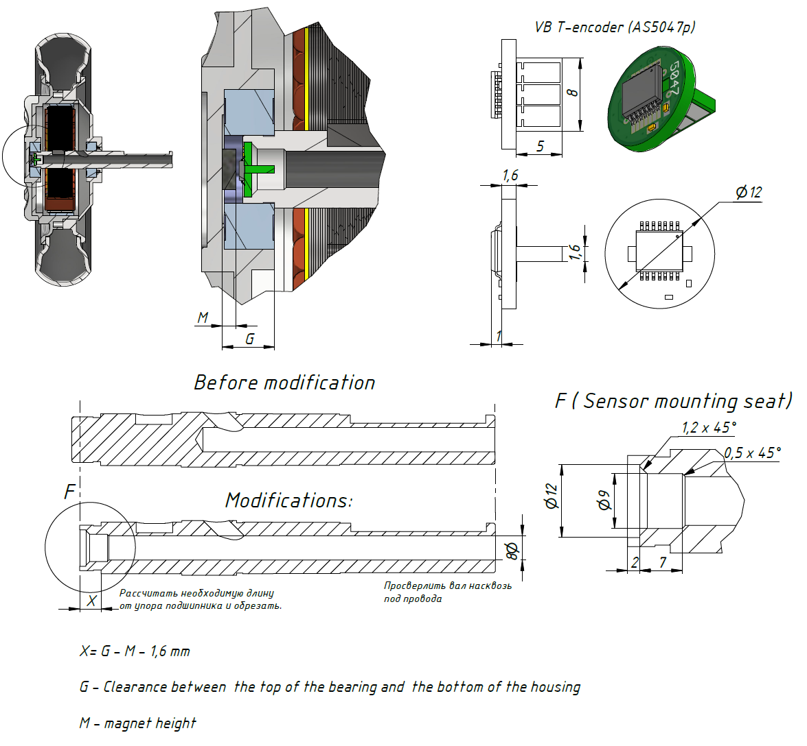

# VBCores T-Encoder (AS5047)
## Overview
This compact breakout board is built around the AS5047P, a high-performance 14-bit magnetic rotary encoder. It provides absolute angular position data with exceptional resolution (16,384 positions per revolution) via SPI output.

T-Encoder PCB designed specifically for DIY motor conversions, this board is the perfect solution for easily upgrading hoverboard motor-wheels into precision torque-controlled motors for robotics, offering a simple and reliable feedback solution for FOC applications.

The sensor consists of two parts and is supplied disassembled. You need to solder the bottom leg yourself (if necessary).

### Features
- **Chip:** AS5047P
- **Interface:** SPI

### Dimensions
- PCB: D12 mm, leg 8x5mm

### Pinout

PDF version: [vb-t-encoder-as5047-pinout.pdf](vb-t-encoder-as5047-pinout.pdf)

### Photos

### 3D model
STEP model: [vb-t-encoder-as5047.stp](vb-t-encoder-as5047.stp)
 
Texture top: [vb-t-encoder-as5047-texture-top.png](vb-t-encoder-as5047-texture-top.png)
 
Texture bottom: [vb-t-encoder-as5047-texture-bottom.png](vb-t-encoder-as5047-texture-bottom.png)

### Usacases and other

Example of modifying hub-wheel

- Full guide [English](https://voltbro.gitbook.io/en-vbcores/example-projects/motor-wheel-upgrade) 

- Full guide [Russian](https://voltbro.gitbook.io/vbcores/tutorials/peredelka-datchika-motor-kolesa) 

