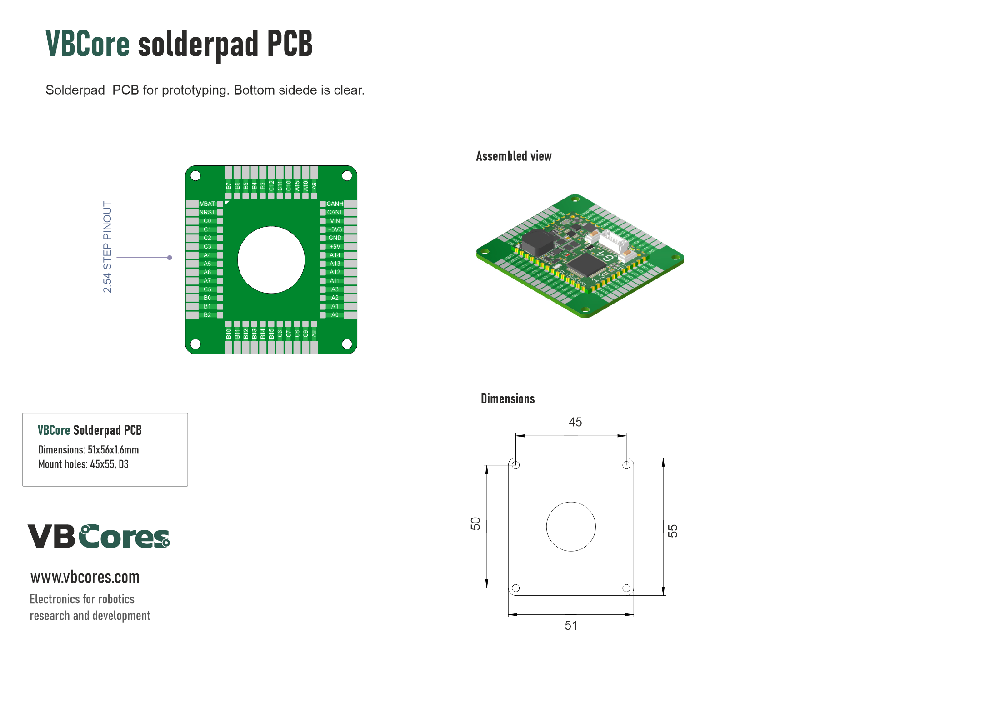
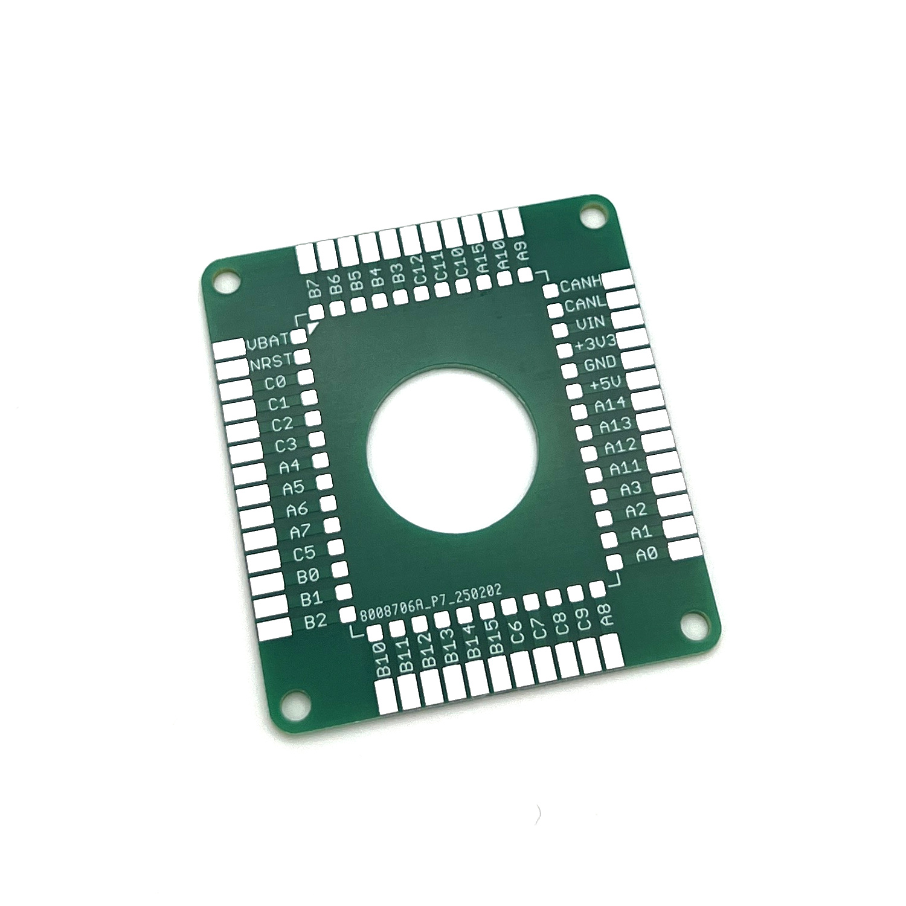
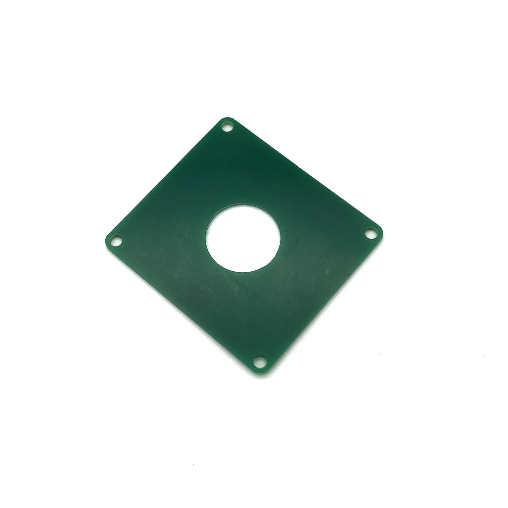
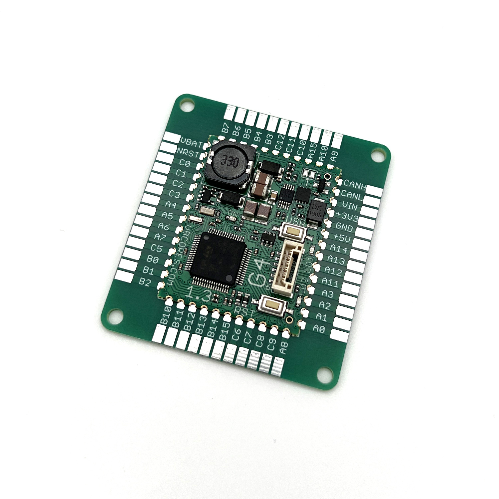
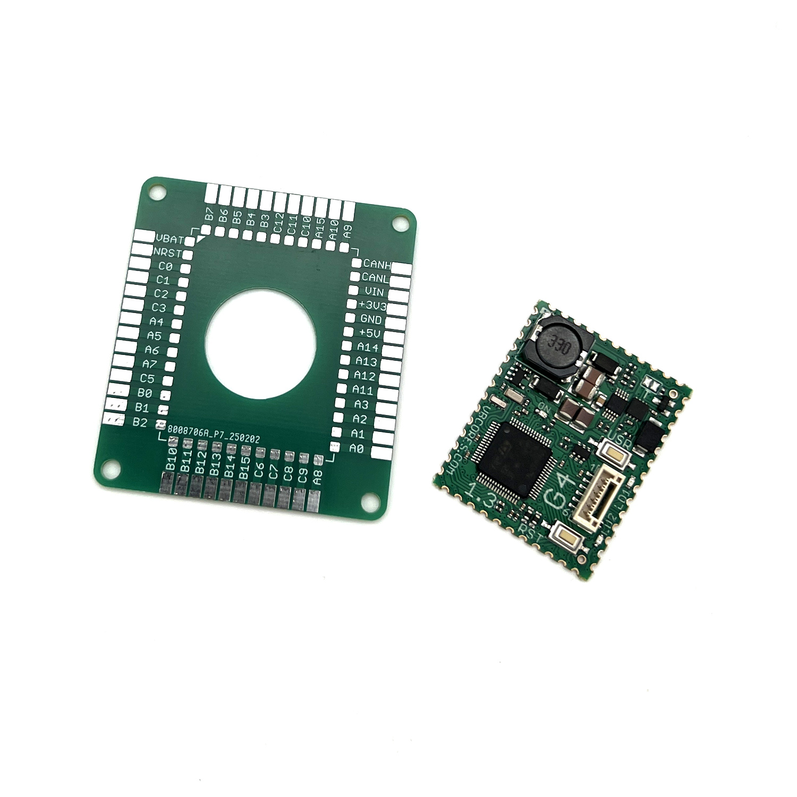
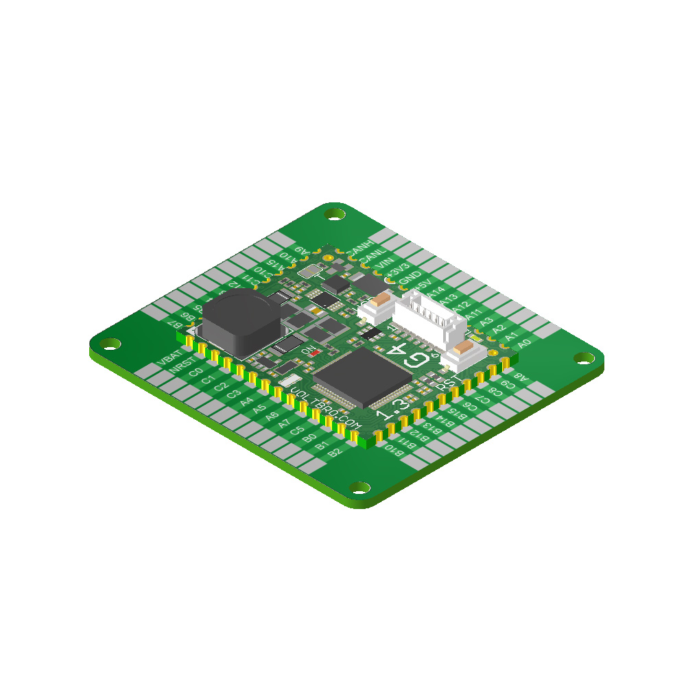
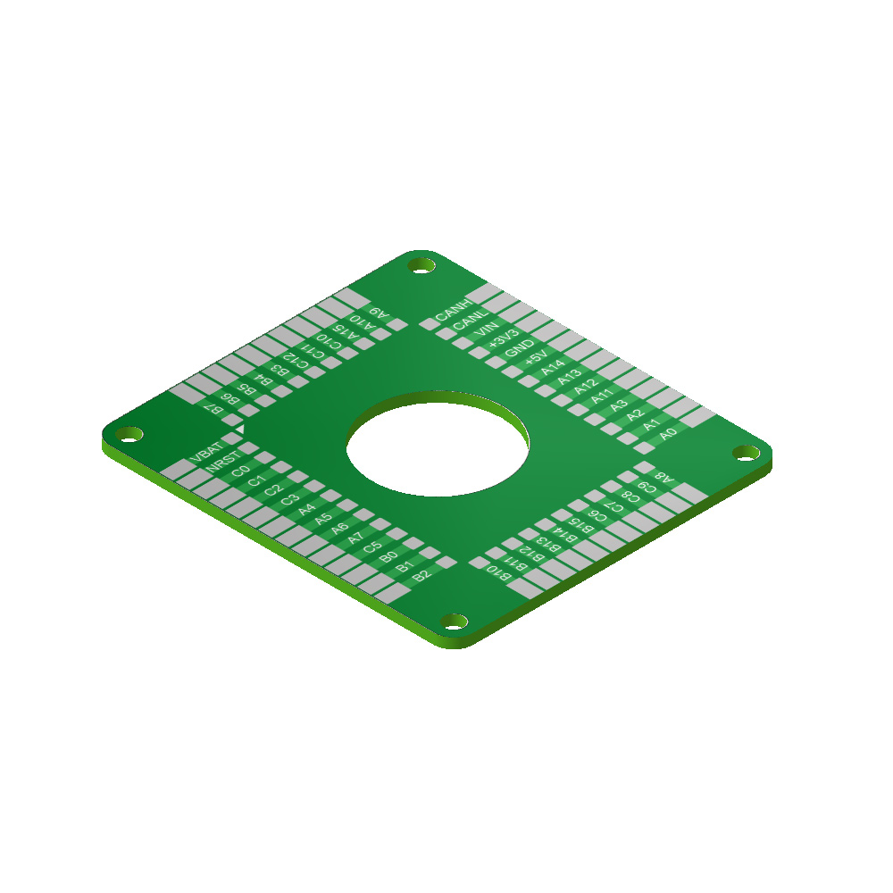

# VBCore Solderpad PCB

## Overview
Compact VBCore32G4 solderpad PCB for prototyping. Bottom sidede is clear.

### Dimensions
- PCB: 51x56 mm
- Mount holes: 45x50mm D:3mm

### Pinout

PDF version: [vbcore-solderpad-pinout.pdf](vbcore-solderpad-pinout.pdf)

### Photos

### 3D model
STEP model: [vbcore-solderpad.stp](vbcore-solderpad-pcb.stp)
 
STEP model with module: [vbcore-solderpad-module.stp](vbcore-solderpad-module.stp)
 DXF model: [vbcore-solderpad.dxf](vbcore-solderpad.dxf)
 
Texture top: [vbcore-solderpad-texture-top.png](vbcore-solderpad-texture-top.png)

