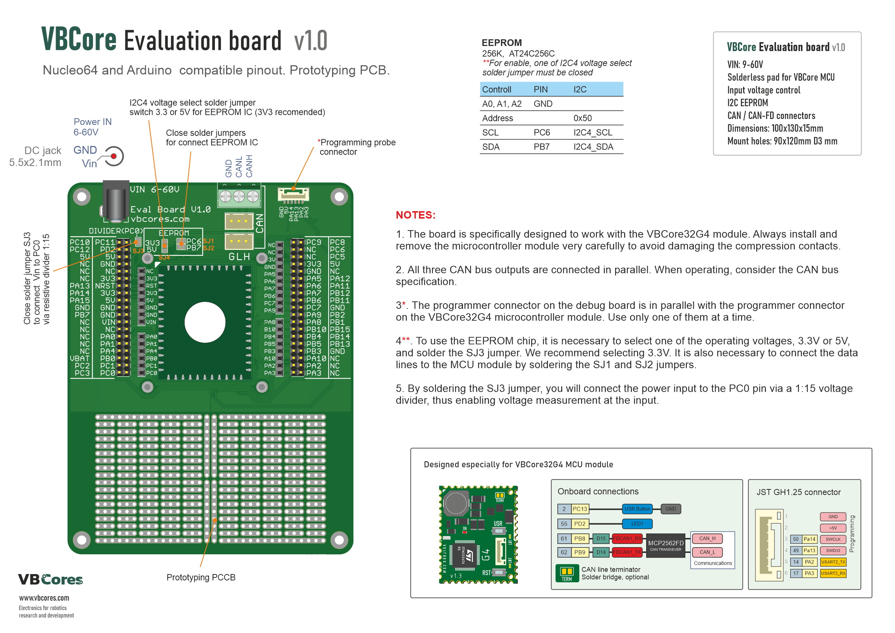
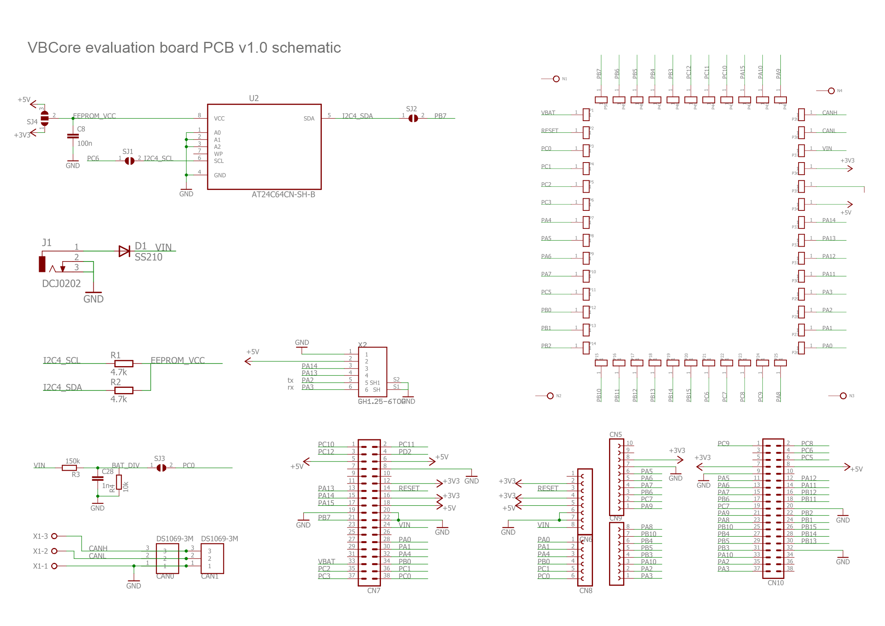
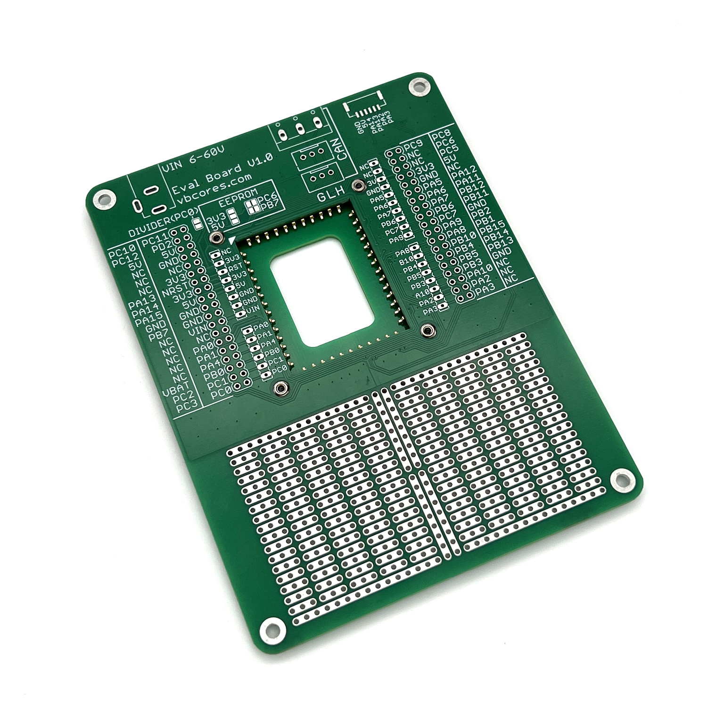
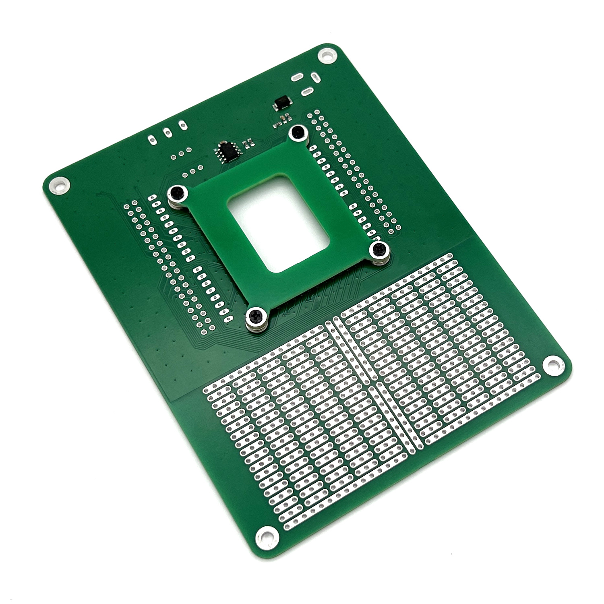
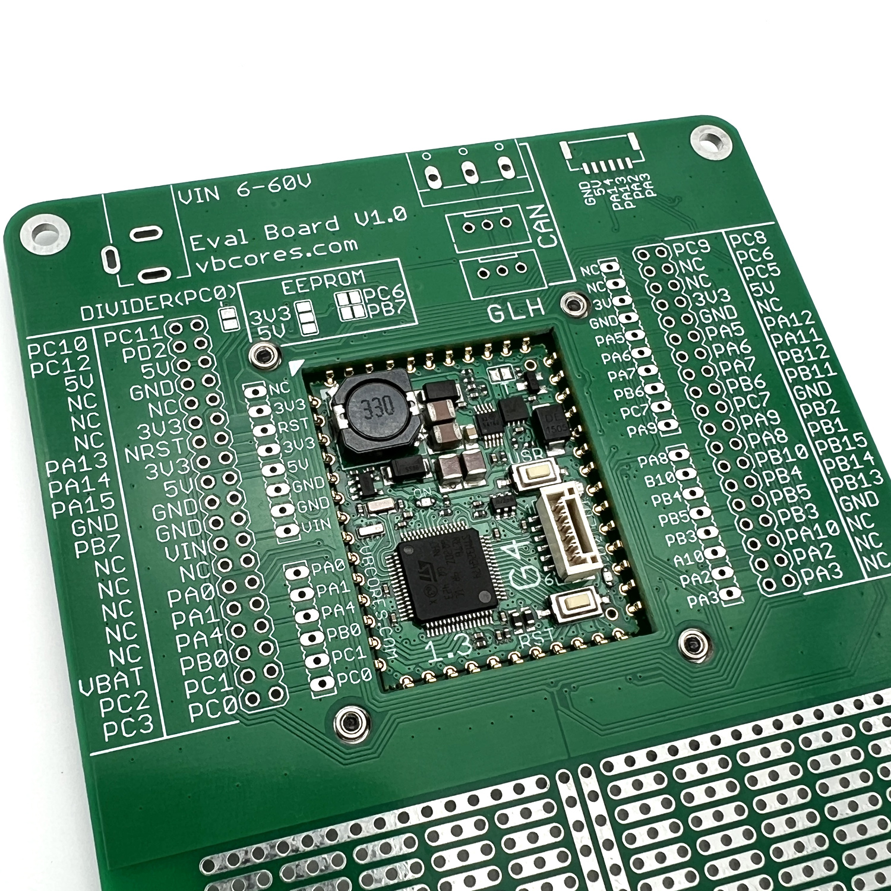
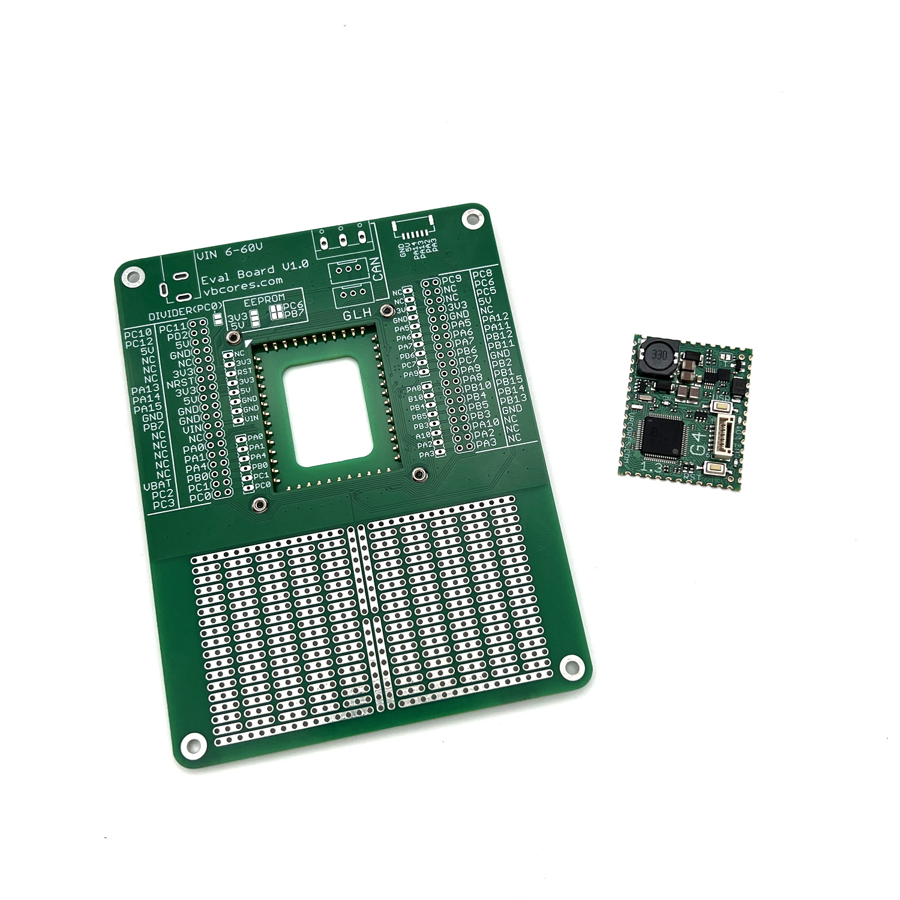
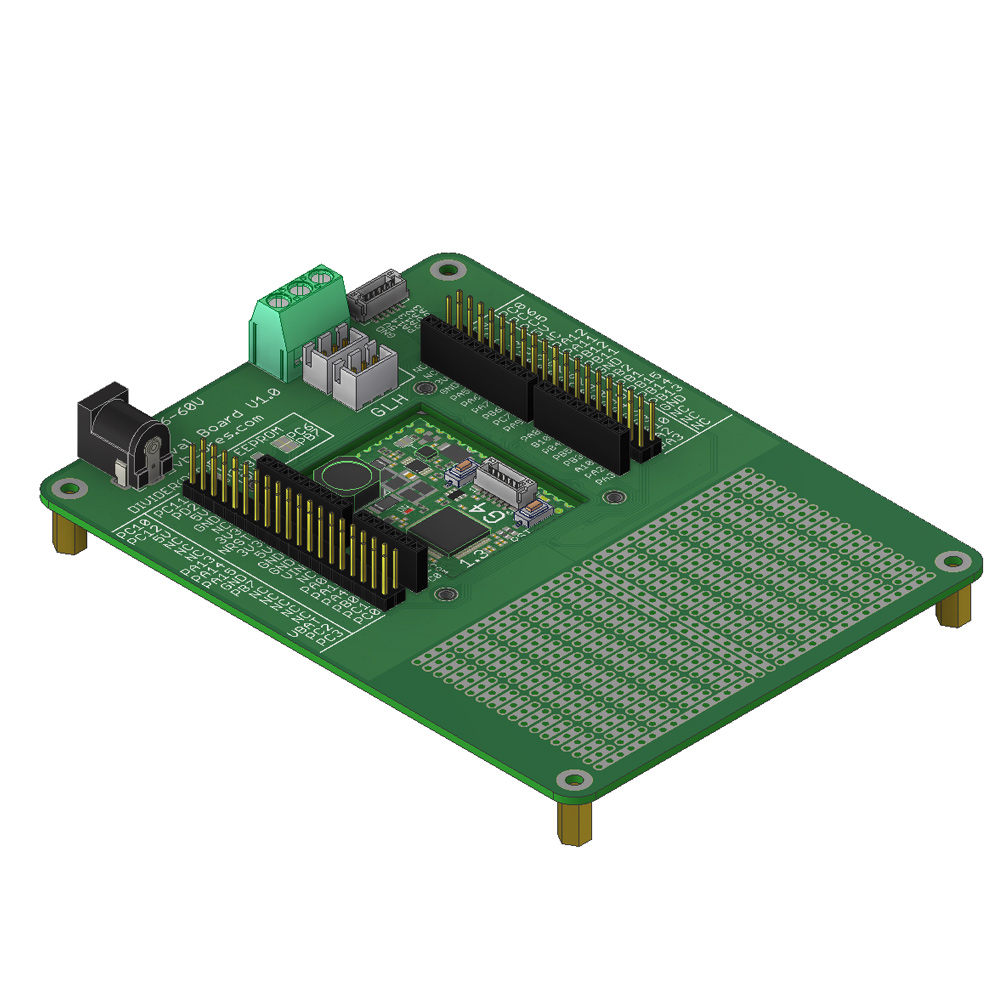

# VBCores Evaluation board
This board is designed for evaluating the capabilities of the VBCore32G4 module. It is ideal for educational purposes and debugging, featuring a dedicated contact pad that eliminates the need for soldering the module.

Designed for [VB32G4 controller](https://github.com/VBCores/VBCores_files/tree/main/01-VB-Core32G4) 

### Features
- **Solderless MCU module bed**
- **Programming port**
- **CAN port**
- **External power DC 2.1 jack**
- **256-Kbit I2C EEPROM**
- **VOltage controll**
- **Prototype PCB**
- **Arduino pinout compatible**
- **Nucleo64 pinout compatible**

### Dimensions
- PCB: 100x130x15 mm
- Mount holes: 90x120mm  D3

### Pinout

PDF version: [vbcore-evaluation-v1_0-pinout.pdf](vbcore-evaluation-v1_0-pinout.pdf)

### Schematic

PDF version: [vbcore-evaluation-v1_0-schematic.pdf](vbcore-evaluation-v1_0-schematic.pdf)

### Photos

### 3D model
STEP model: [vbcore-evaluation-v1_0.stp](vbcore-evaluation-v1_0.stp)
 
Texture top: [vbcore-evaluation-v1_0-texture-top.png](vbcore-evaluation-v1_0-texture-top.png)
 
Texture bottom: [vbcore-evaluation-v1_0-texture-bottom.png](vbcore-evaluation-v1_0-texture-bottom.png)

