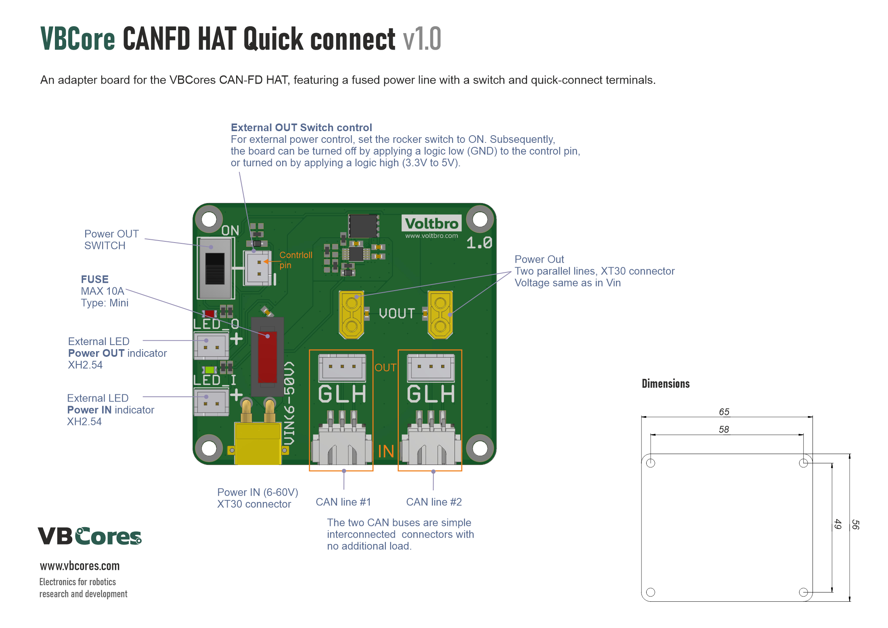
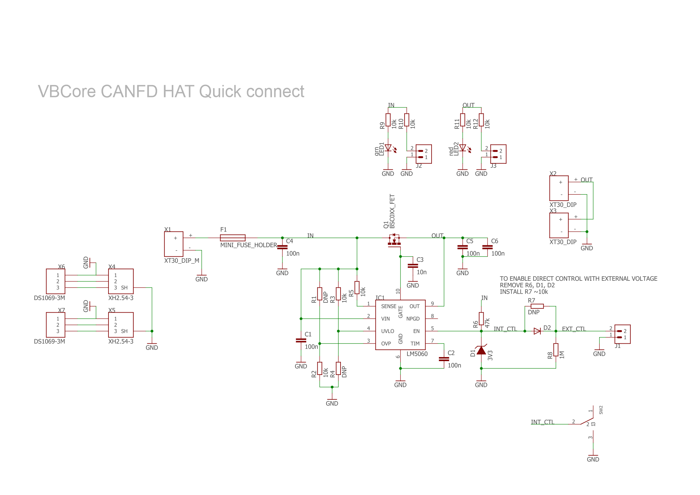
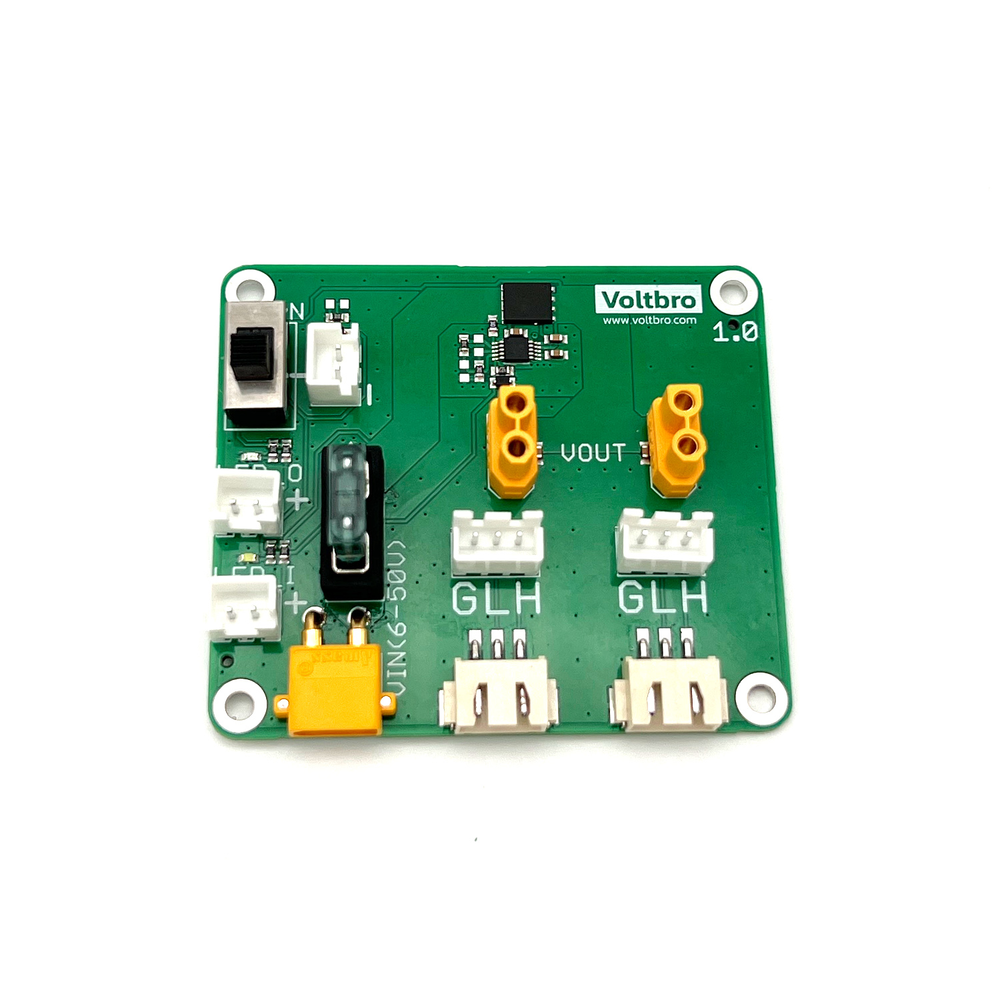
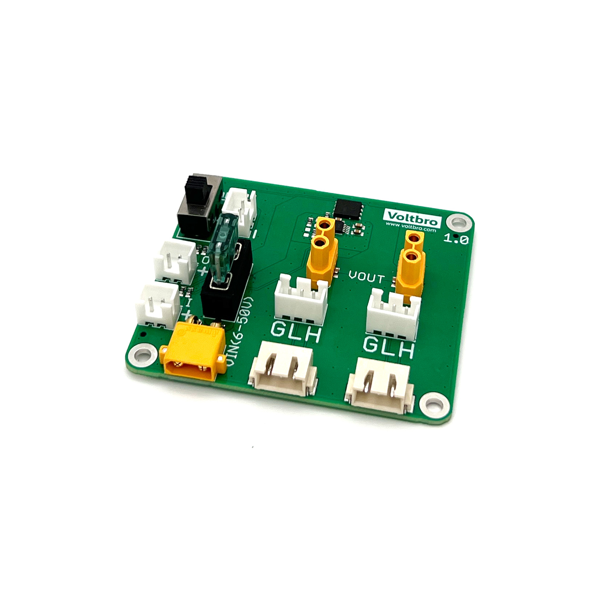
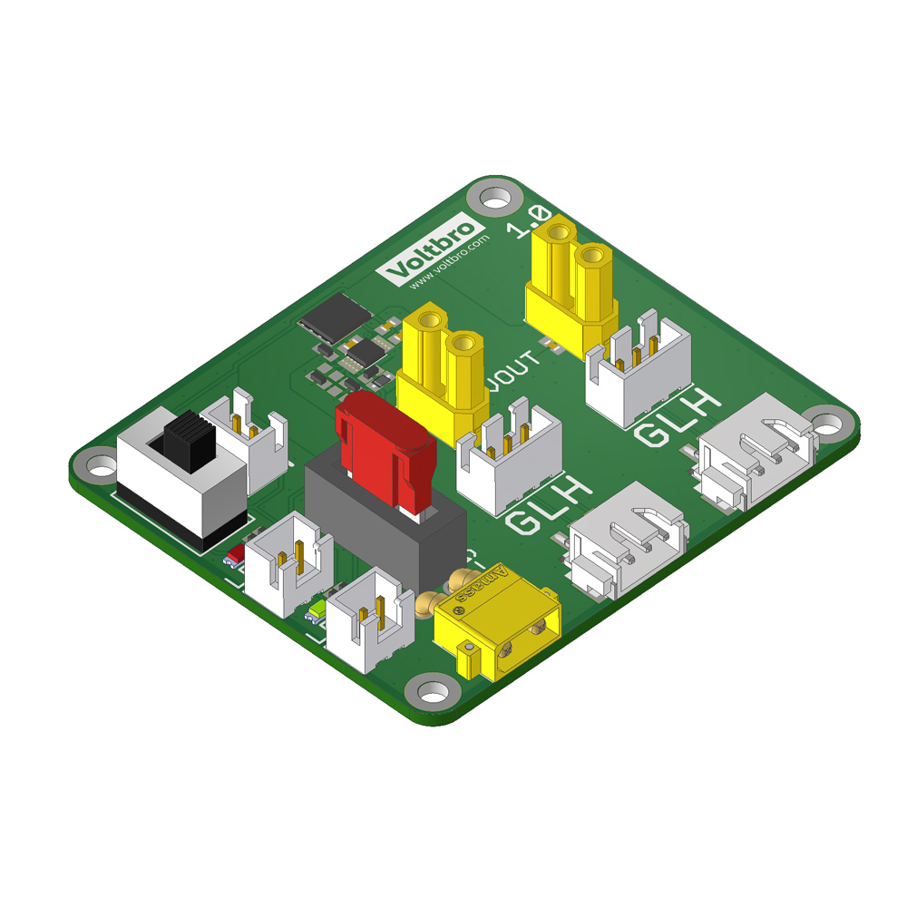
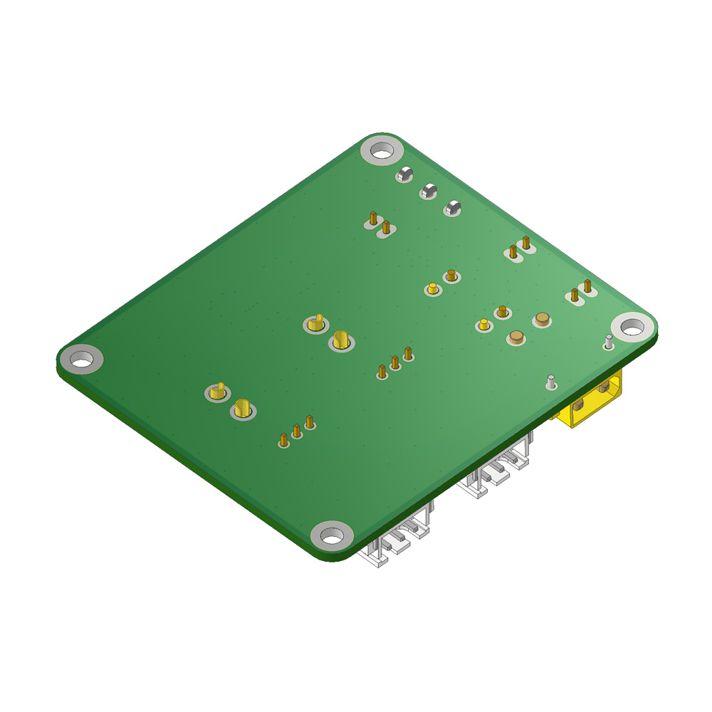

# VBCore CANFD HAT Quick connect v1.0

An adapter board for the [VBCores CAN-FD HAT](https://github.com/VBCores/VBCores_files/tree/main/06-VB-CANFD-Rpi-Hat), featuring a fused power line with a switch and quick-connect terminals.

### Features
- **Quisck connectors**
- - XH2.54 for CAN lines
- - XT30 for power lines
- **Power FUSE**
- **Power Switch**
- **External controlls**
- - Power In LED
- - Power Out LED
- - Power Switch

### Dimensions
- PCB: 65x56x15 mm
- Mount holes: 58x49mm  D2.5

### Pinout

PDF version: [vb-canhat-qc-pinout.pdf](vb-canhat-qc-v1_0-pinout.pdf)

### Schematic

PDF version: [vb-canhat-qc-v1_0-schematic.pdf] (vb-canhat-qc-v1_0-schematic.pdf)

### Photos

### 3D model
STEP model: [vb-canhat-qc-v1_0.stp](vb-canhat-qc-v1_0.stp)
 
Texture top: [vb-canhat-qc-v1_0-texture-top.png](vb-canhat-qc-v1_0-texture-top.png)
 
Texture bottom: [vb-canhat-qc-v1_0-texture-bottom.png](vb-canhat-qc-v1_0-texture-bottom.png)

