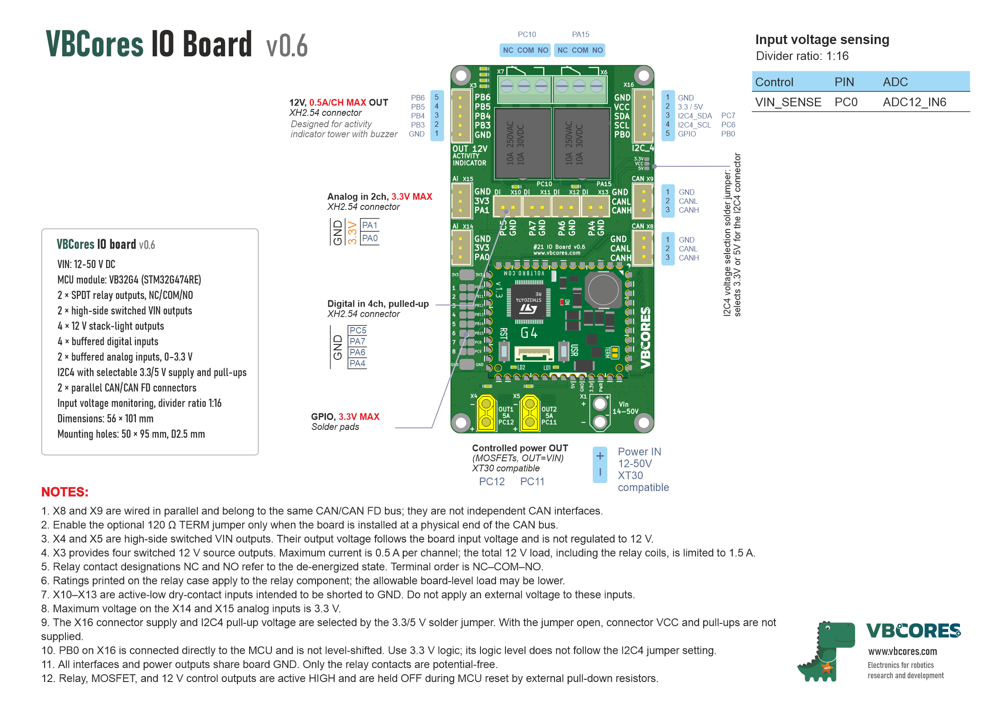
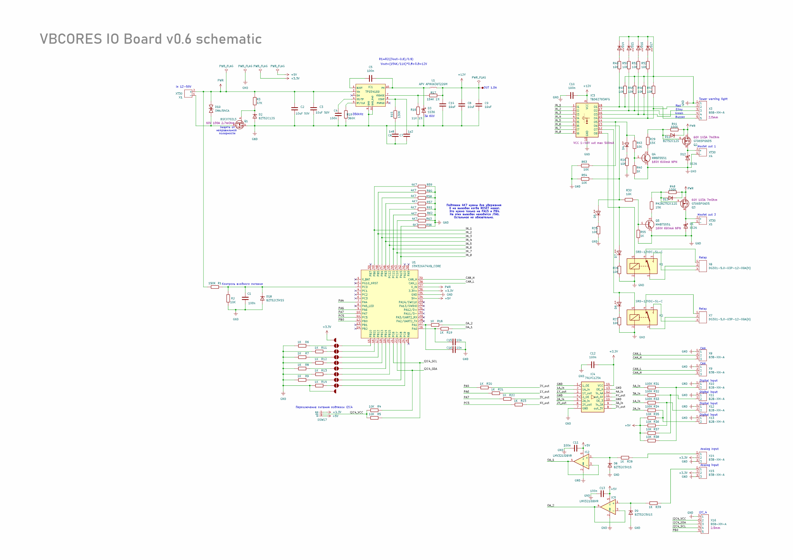
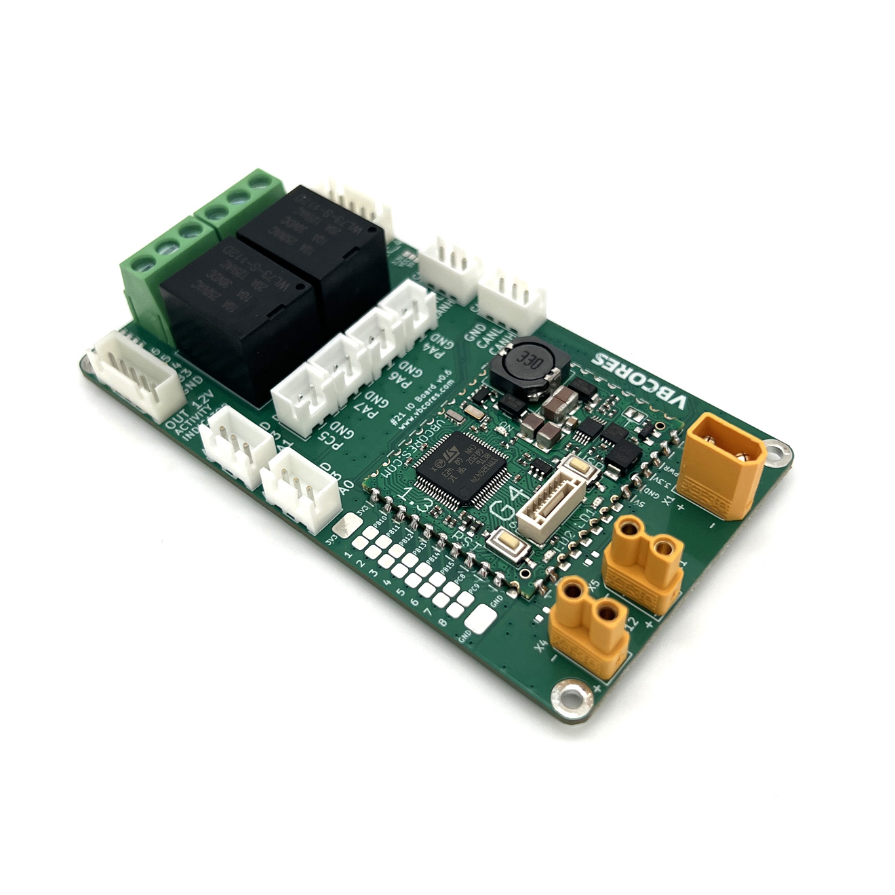
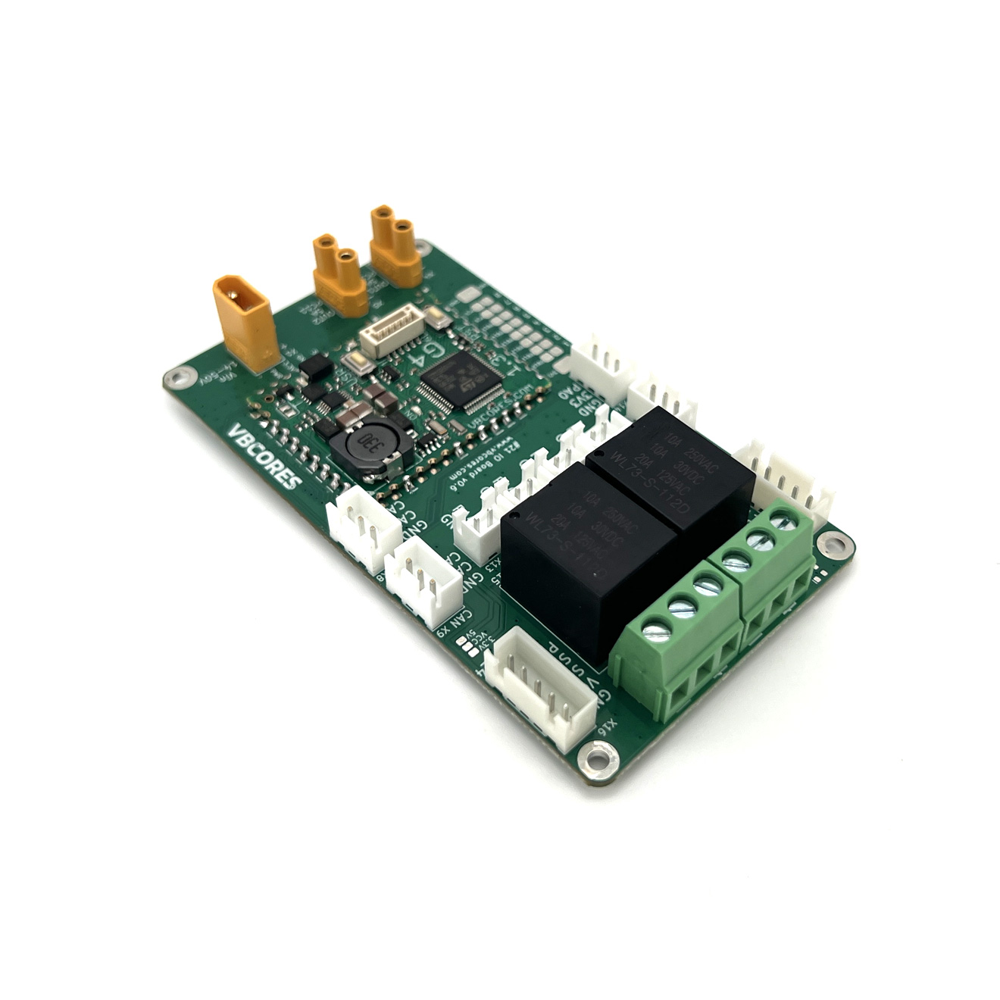
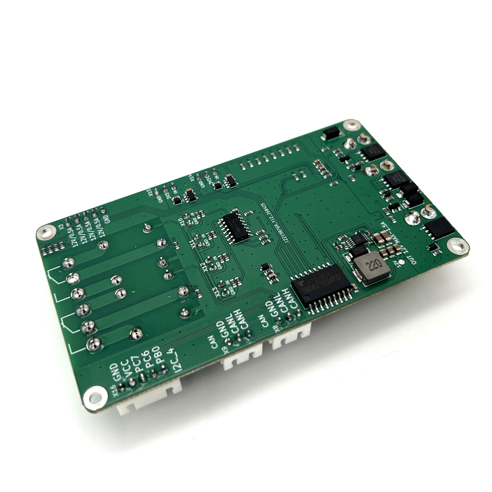
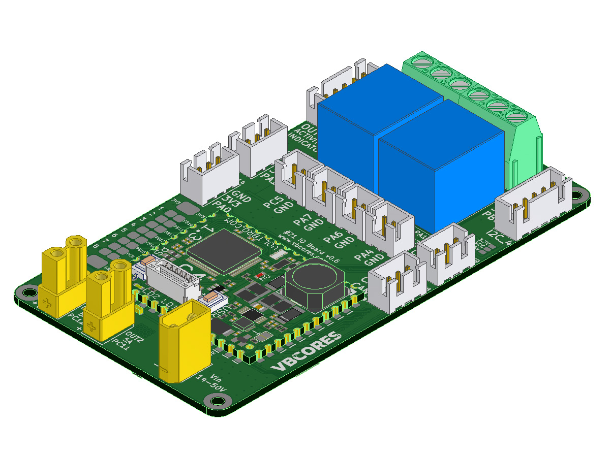
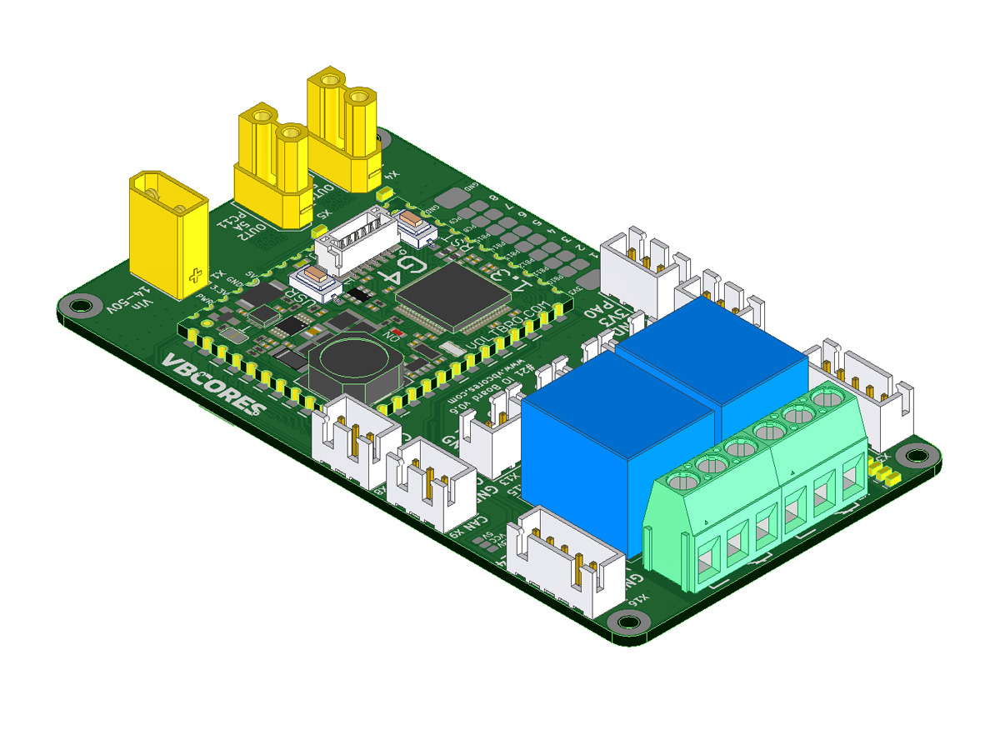
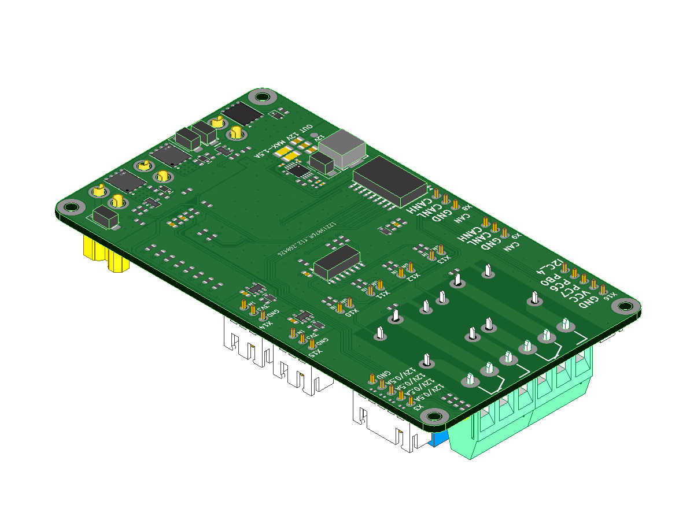

[**English**](README.md) | [Русский](README.ru.md)

# VBCores IO Board v0.6

VBCores IO Board connects sensors, relays, and external loads to an STM32 microcontroller. It is based on the [VB32G4](../01-VB-Core32G4/README.md) module with an STM32G474RE microcontroller.

The board provides connections for:

- two loads controlled through relays;
- two high-power loads supplied from VIN;
- a signal tower or four other 12 V loads;
- four buttons, limit switches, or other dry contacts;
- two analog sensors with 0–3.3 V outputs;
- CAN / CAN FD devices;
- an I2C device with a 3.3 V or 5 V supply.

### Pinout

PDF version: [vb-io-board-v0_6-pinout.pdf](vb-io-board-v0_6-pinout.pdf)

## Main Specifications

| Parameter | Value |
| --- | --- |
| Input voltage | 12–50 V DC |
| Microcontroller module | VB32G4 based on STM32G474RE |
| Relays | 2 changeover relays with NC / COM / NO contacts |
| Switched VIN outputs | 2 channels, X4 and X5 |
| 12 V outputs | 4 channels, maximum 0.5 A per channel |
| Digital inputs | 4 inputs for switches to GND |
| Analog inputs | 2 inputs, 0–3.3 V |
| CAN / CAN FD | 2 parallel connectors on one bus |
| I2C4 | Selectable 3.3 V or 5 V supply and pull-ups |
| VIN measurement | 1:16 voltage divider |

The board can operate with an input voltage of about 9 V, but this is not its normal operating range. Below 14 V, the on-board converter may not provide a stable 12 V output. Use an input voltage of at least 14 V when the X3 outputs or relay coils require a stable 12 V supply.

The total current available from the 12 V rail is limited to 1.5 A. This includes the X3 loads and both relay coils.

### Dimensions

- Board size: 56 × 101 mm
- Mounting hole spacing: 50 × 95 mm
- Mounting hole diameter: 2.5 mm

### Schematic

PDF version: [vb-io-board-v0_6-schematic.pdf](vb-io-board-v0_6-schematic.pdf)

## Connectors

The tables below show the microcontroller pin that reads an input or controls an output. An em dash (—) means that the connector contact is not connected directly to a microcontroller pin.

### X1 — Board Power Input

XT30-compatible connector. Follow the polarity markings on the board.

| Contact | MCU pin | Function and notes |
| --- | --- | --- |
| `+` | — | VIN power input, 12–50 V |
| `−` | — | GND, power return |

### X3 — Four 12 V Outputs

5-pin JST XH connector with 2.50 mm pitch. Each output turns on when its microcontroller pin is set HIGH.

| Contact | MCU pin | Function and notes |
| --- | --- | --- |
| 1 | — | GND |
| 2 | PB3 | 12 V output; red signal-tower section |
| 3 | PB4 | 12 V output; yellow signal-tower section |
| 4 | PB5 | 12 V output; green signal-tower section |
| 5 | PB6 | 12 V output; buzzer |

The colors and buzzer are suggested functions. All four channels are identical switched 12 V outputs. The maximum current is 0.5 A per channel. The combined current of the X3 loads and both relay coils must not exceed 1.5 A.

### Power Outputs OUT1 and OUT2

When an output is enabled, its connector receives the same voltage as the VIN input. The outputs are enabled by a HIGH level.

| Output | MCU pin | Function and notes |
| --- | --- | --- |
| OUT1, X4 | PC12 | A HIGH level enables the output |
| OUT2, X5 | PC11 | A HIGH level enables the output |

X4 and X5 are XT30-compatible. The `5 A` marking on the board is the design output current. The allowable continuous current depends on cooling, connector and wire ratings, and operating conditions.

### Relay Outputs

Each relay has three contacts: NC is normally closed, COM is common, and NO is normally open. These names describe the relay in its de-energized state. A HIGH level energizes the relay and switches COM from NC to NO.

| Relay | Connector | MCU pin | Function and notes |
| --- | --- | --- | --- |
| Relay 1 | X6 | PA15 | A HIGH level energizes the relay |
| Relay 2 | X7 | PC10 | A HIGH level energizes the relay |

The relay contacts are electrically isolated from the rest of the board. Ratings printed on the relay case apply to the relay component. The allowable board-level load may be lower and depends on voltage, load type, connector rating, and operating conditions.

### CAN / CAN FD

X8 and X9 are wired in parallel and connect to the same CAN / CAN FD bus. Enable the optional 120 Ω `TERM` jumper on the VB32G4 module only when the board is located at a physical end of the CAN bus.

### Digital Inputs

These inputs are intended for buttons, limit switches, and other voltage-free dry contacts. An open contact reads HIGH; shorting the input to GND reads LOW.

| Input | MCU pin | Function and notes |
| --- | --- | --- |
| X10 | PC5 | Digital input 1, switch to GND |
| X11 | PA7 | Digital input 2, switch to GND |
| X12 | PA6 | Digital input 3, switch to GND |
| X13 | PA4 | Digital input 4, switch to GND |

Do not apply an external voltage to X10–X13.

### Analog Inputs

Both inputs measure voltages from 0 to 3.3 V.

| Input | MCU pin | Function and notes |
| --- | --- | --- |
| X14 | PA0 | Analog input 1, ADC12_IN1 |
| X15 | PA1 | Analog input 2, ADC12_IN2 |

Each connector also provides GND and a 3.3 V supply for a sensor. Do not apply more than 3.3 V to an analog input.

### X16 — I2C4 and Additional GPIO

5-pin JST XH connector with 2.50 mm pitch.

| Contact | MCU pin | Function and notes |
| --- | --- | --- |
| 1 | — | GND |
| 2 | — | VCC: 3.3 V or 5 V, selected by solder jumper |
| 3 | PC7 | I2C4 SDA, data line |
| 4 | PC6 | I2C4 SCL, clock line |
| 5 | PB0 | Additional GPIO, 3.3 V logic only |

The solder jumper next to X16 selects the connector supply and I2C4 pull-up voltage:

| Jumper setting | Result |
| --- | --- |
| Connected to 3.3 V | X16 VCC and I2C4 pull-ups use 3.3 V |
| Connected to 5 V | X16 VCC and I2C4 pull-ups use 5 V |
| Open | X16 VCC and I2C4 pull-ups are not powered |

Select only one voltage. PB0 is connected directly to the microcontroller without a level shifter and always uses 3.3 V logic, regardless of the jumper setting.

## Additional GPIO Pads

Eight additional microcontroller signals are available on solder pads.

| Pad | MCU pin | Function and notes |
| --- | --- | --- |
| 1 | PB10 | GPIO, 3.3 V logic |
| 2 | PB11 | GPIO, 3.3 V logic |
| 3 | PB12 | GPIO, 3.3 V logic |
| 4 | PB13 | GPIO, 3.3 V logic |
| 5 | PB14 | GPIO, 3.3 V logic |
| 6 | PB15 | GPIO, 3.3 V logic |
| 7 | PC8 | GPIO, 3.3 V logic |
| 8 | PC9 | GPIO, 3.3 V logic |

The pad group also provides 3.3 V and GND. Do not apply more than 3.3 V to a GPIO.

## Input Voltage Measurement

VIN is connected to a microcontroller analog input through a 1:16 voltage divider.

| Signal | MCU pin | ADC channel | Notes |
| --- | --- | --- | --- |
| VIN_SENSE | PC0 | ADC12_IN6 | The ADC input voltage is 16 times lower than VIN |

Use the following formula:

`VIN = VADC × 16`

Measurement accuracy depends on the actual ADC reference voltage and the resistor tolerances.

## Important Notes

1. All connectors share board GND except for the relay contacts on X6 and X7.
2. X3 provides 12 V outputs, while X4 and X5 provide switched VIN. These are different voltages.
3. The maximum combined current from the 12 V rail is 1.5 A, including both relay coils.
4. Do not apply more than 3.3 V to X14, X15, X16 PB0, or the additional GPIO pads.
5. External resistors hold the relays, X3, X4, and X5 off during power-up and microcontroller reset.

## SWD Connector on the VB32G4 Module

The VB32G4 module has a 6-pin JST GH connector with 1.25 mm pitch for programming and debugging.

| Contact | MCU pin | Function and notes |
| --- | --- | --- |
| 1 | — | GND |
| 2 | — | 5 V |
| 3 | SWCLK | SWD clock line |
| 4 | SWDIO | SWD data line |
| 5 | TX USART2 | UART transmit |
| 6 | RX USART2 | UART receive |

## Development Resources

- [VB32G4 controller documentation](../01-VB-Core32G4/README.md)
- [VB32G4 v1.3 pinout](../01-VB-Core32G4/vbcore32g4-v1_3-pinout.pdf)
- [Arduino sketch for electrical tests](vb-io-board-v0_6-tests.ino)

When firmware starts, write LOW to the relay, X3, X4, and X5 control pins before configuring them as outputs.

### Photos

### 3D Models and Textures

STEP model: [vb-io-board.stp](vb-io-board.stp)
 
Top texture: [vb-io-board-v0_6-texture-top.png](vb-io-board-v0_6-texture-top.png)
 
Bottom texture: [vb-io-board-v0_6-texture-bottom.png](vb-io-board-v0_6-texture-bottom.png)

