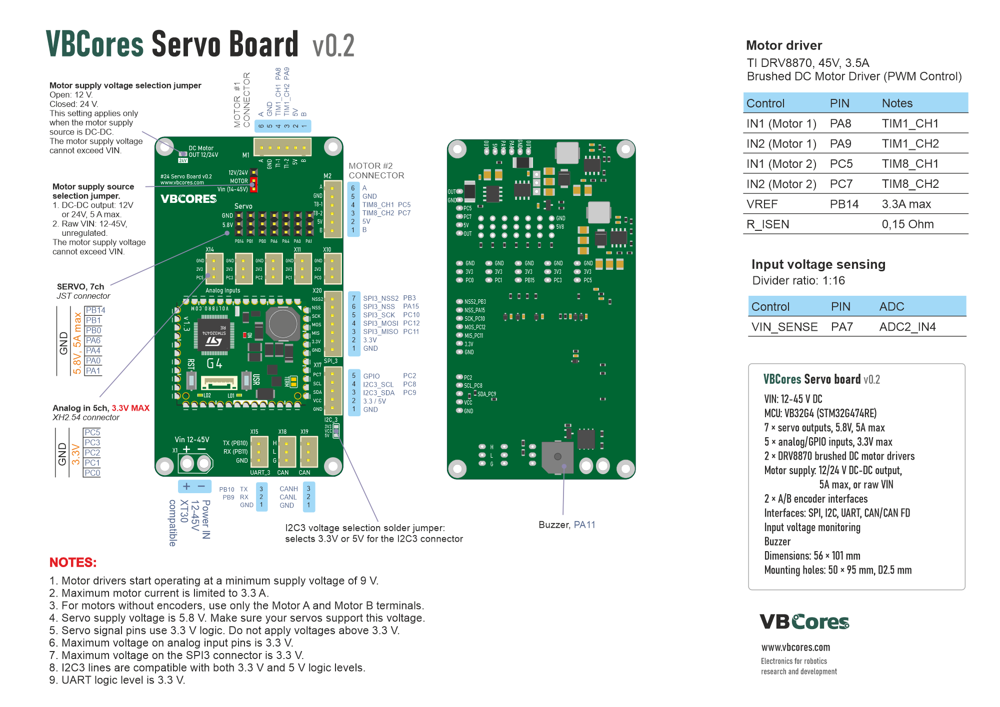
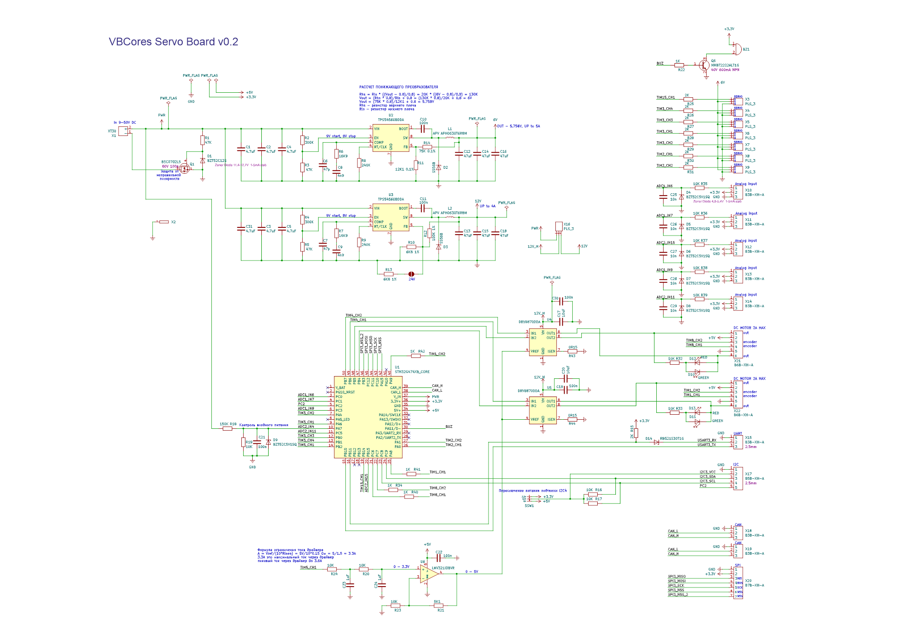
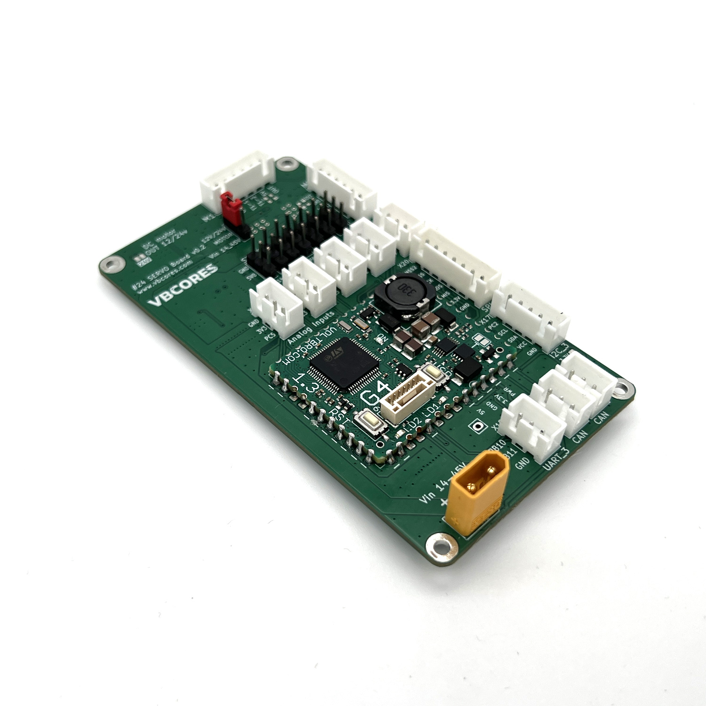
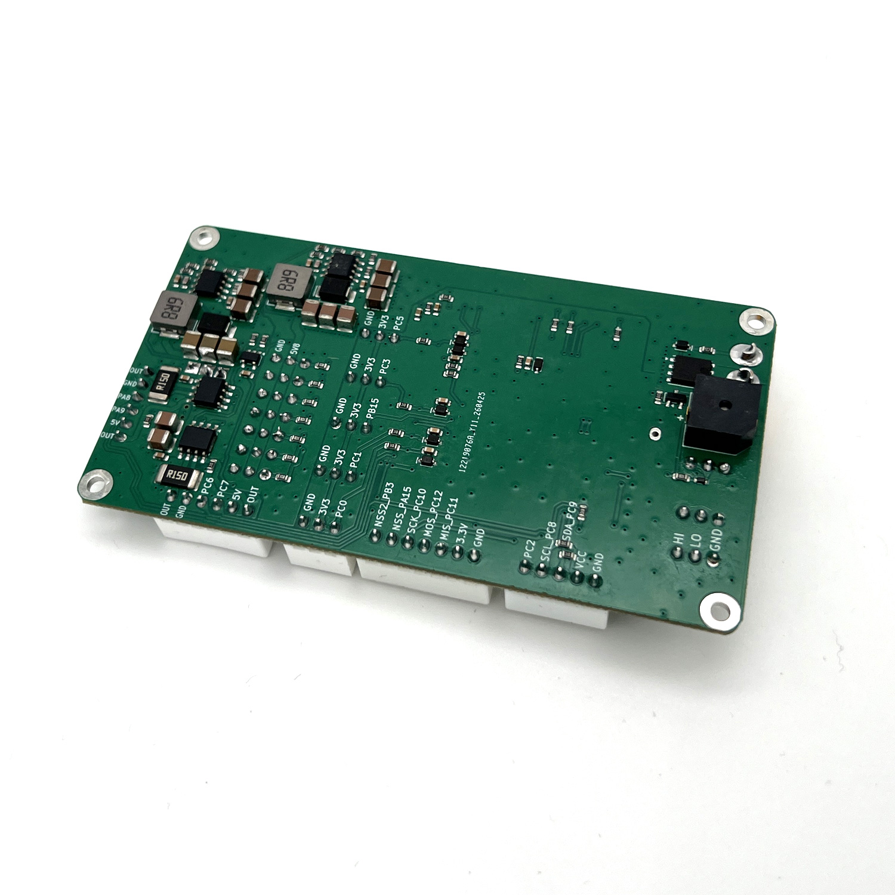
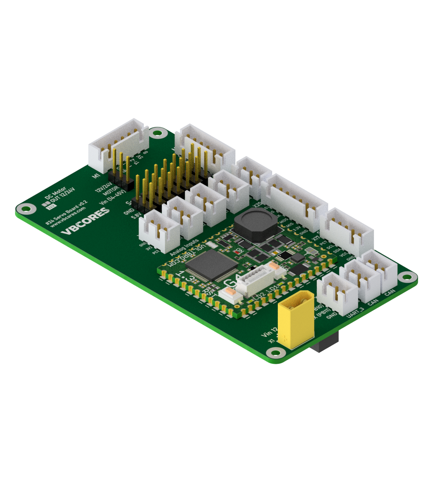
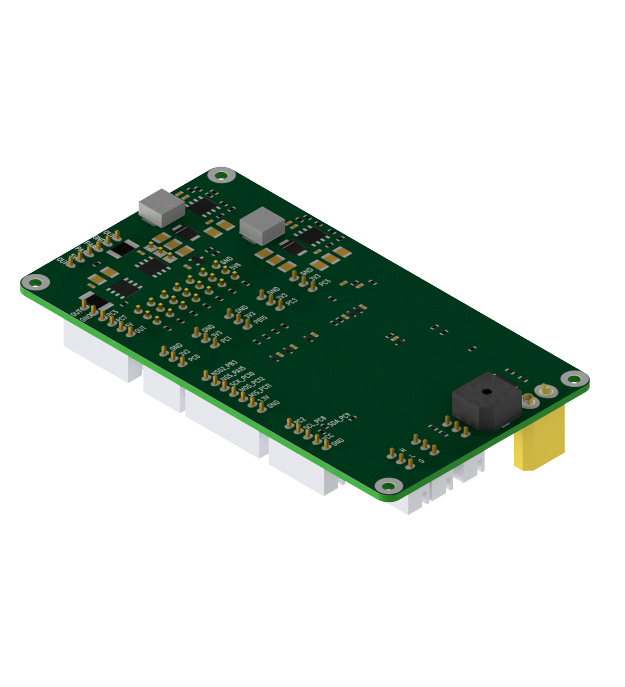

# VBCores Servo Board v0.2

## Overview
The VBCores Servo Board is a compact motor and peripheral control board for small robotic systems. It combines a VB32G4 controller module, seven PWM servo outputs, two brushed DC motor drivers, A/B encoder interfaces, analog/GPIO inputs, and standard communication interfaces on a single PCB.

The board is intended for mobile robots, servo-based mechanisms, motor-control experiments, and educational robotics platforms where several actuators and sensor interfaces must be connected to one STM32-based controller.

Based on [VB32G4 controller](https://github.com/VBCores/VBCores_files/tree/main/01-VB-Core32G4)

### Pinout

PDF version: [vb-servoboard-v0_2-pinout.pdf](vb-servoboard-v0_2-pinout.pdf)

### Features
- **MCU module:** VB32G4 based on STM32G474RE
- **Servo outputs:** 7 channels, 5.8 V servo supply, 5 A max
- **Brushed DC motor drivers:**
	- 2 × TI DRV8870 brushed DC motor drivers
	- PWM control from STM32 timer outputs
	- Current limit: 3.3 A
- **Motor supply options:**
	- On-board DC-DC output: 12 V or 24 V, 5 A max
	- Raw VIN motor supply
- **Encoder interfaces:** 2 × A/B incremental encoder interfaces
- **Analog/GPIO inputs:** 5 channels, 3.3 V max
- **Interfaces:**
	- SPI3, 3.3 V logic
	- I2C3 with selectable 3.3 V / 5 V connector supply
	- UART, 3.3 V logic
	- CAN / CAN FD
- **Input voltage sensing:** resistive divider 1:16
- **Buzzer**

### Specs
- **Power Input:** 12-45 V DC
- **Servo Supply:** 5.8 V, 5 A max
- **Motor Supply:** 12/24 V DC-DC output, 5 A max, or raw VIN
- **Motor Current Limit:** 3.3 A
- **Motor Driver IC:** TI DRV8870, 45 V, 3.5 A
- **Servo Signal Logic Level:** 3.3 V
- **UART / SPI Logic Level:** 3.3 V
- **Analog/GPIO Input Voltage:** 3.3 V max
- **I2C3 Logic Compatibility:** 3.3 V and 5 V logic levels

  
### Dimensions
- PCB: 56x101 mm
- Mounting holes: 50x95 mm, D2.5 mm

### Schematic

PDF version: [vb-servoboard-v0_2-schematic.pdf](vb-servoboard-v0_2-schematic.pdf)

### Motor Driver Pin Mapping

TI DRV8870, 45 V, 3.5 A brushed DC motor driver with PWM control.

| Control       | PIN  | Notes    |
| ------------- | ---- | -------- |
| IN1 (Motor 1) | PA8  | TIM1_CH1 |
| IN2 (Motor 1) | PA9  | TIM1_CH2 |
| IN1 (Motor 2) | PC5  | TIM8_CH1 |
| IN2 (Motor 2) | PC7  | TIM8_CH2 |
| VREF          | PB14 | 3.3 A max |
| R_ISEN        | -    | 0.15 Ohm |

### Input Voltage Sensing

Resistive divider ratio: 1:16.

| Control   | PIN | ADC      |
| --------- | --- | -------- |
| VIN_SENSE | PA7 | ADC2_IN4 |

### Configuration Jumpers

#### Motor Supply Voltage Selection

| Jumper state | Motor supply voltage |
| ------------ | -------------------- |
| Open         | 12 V                 |
| Closed       | 24 V                 |

This setting applies only when the motor supply source is set to DC-DC. The motor supply voltage cannot exceed VIN.

#### Motor Supply Source Selection

| Position | Motor supply source |
| -------- | ------------------- |
| 1        | DC-DC output: 12/24 V, 5 A max |
| 2        | Raw VIN: 12-45 V, unregulated |

The motor supply voltage cannot exceed VIN.

#### I2C3 Voltage Selection

The I2C3 voltage selection solder jumper selects 3.3 V or 5 V for the I2C3 connector.

### Notes
1. Motor drivers start operating at a minimum supply voltage of 9 V.
2. Maximum motor current is limited to 3.3 A.
3. For motors without encoders, use only the Motor A and Motor B terminals.
4. Servo supply voltage is 5.8 V. Make sure your servos support this voltage.
5. Servo signal pins use 3.3 V logic. Do not apply voltages above 3.3 V.
6. Maximum voltage on analog input pins is 3.3 V.
7. Maximum voltage on the SPI3 connector is 3.3 V.
8. I2C3 lines are compatible with both 3.3 V and 5 V logic levels.
9. UART logic level is 3.3 V.

### SWD Interface for VBCore32G4

JST GH1.25, 6pin

| Pin      | Is           | 
| -------- | -------------|
| 1        | GND          |
| 2        | 5V           |
| 3        | SWCLK        |
| 4        | SWDIO        |
| 5        | TX USART2    |
| 6        | RX USART2    |

### Development Resources

### Photos

### 3D model

STEP model: [vb-servoboard.stp](vb-servoboard.stp)
 
Texture top: [vb-servoboard-v0_2-texture-top.png](vb-servoboard-v0_2-texture-top.png)
 
Texture bottom: [vb-servoboard-v0_2-texture-bottom.png](vb-servoboard-v0_2-texture-bottom.png)

